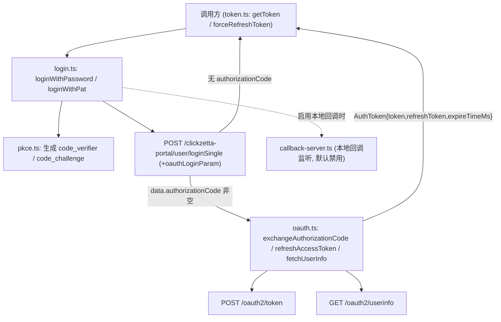
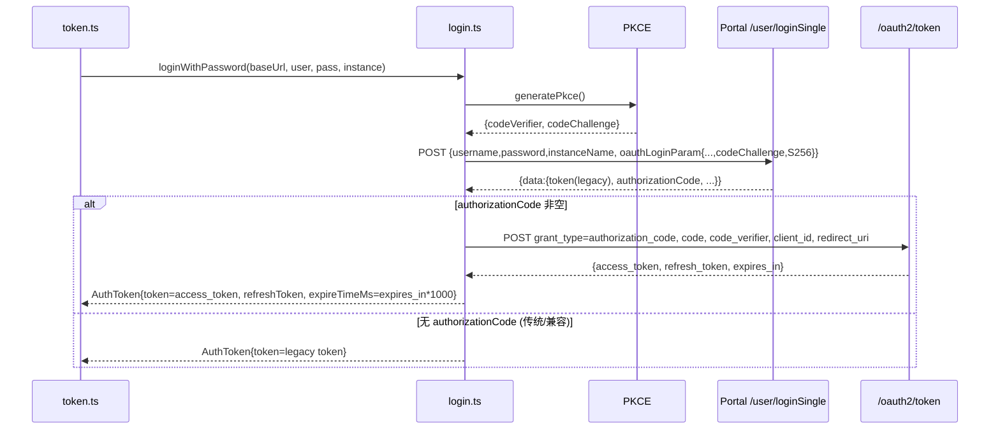

# Design Document

> cz-cli OAuth2 登录接入 — 技术设计

## Overview

本设计在 `@clickzetta/sdk`（`packages/clickzetta-sdk`）的认证层引入 OAuth2 授权码 + PKCE 流程，使 `loginWithPassword` / `loginWithPat` 在 OAuth 模式下获取 `access_token` / `refresh_token`，并让 token 缓存层（`token.ts`）在过期时优先使用 refresh token 轮换续期。改造遵循以下原则：

- **最小侵入、向后兼容**：保持 `loginWithPat` / `loginWithPassword` 的现有签名与传统登录行为；OAuth 仅在服务端返回 `authorizationCode` 时生效。
- **复用既有重试链路**：登录请求继续走 `postLogin` 的重试 / 退避 / 实例错误识别逻辑，OAuth 只是在登录成功之后追加“换取 token”步骤。
- **本期手动粘贴优先**：默认通过登录响应中直接返回的 `authorizationCode`（免浏览器路径）或手动粘贴获取授权码；本地回调监听作为独立模块实现但默认禁用。
- **TDD 对齐**：已有的 `packages/clickzetta-sdk/test/login-oauth.test.ts` 定义了目标行为（发送 `oauthLoginParam`、换取授权码、`AuthToken.refreshToken`），本设计需让该测试通过。

设计覆盖需求 1–8。

## Architecture

OAuth 登录链路分为四个职责模块，全部位于 SDK 认证层：



登录时序（手动粘贴 / 免浏览器默认路径）：



## Components and Interfaces

### 1. `src/auth/oauth-constants.ts`（新增）

集中 OAuth 客户端常量，避免散落字符串。

```ts
export const OAUTH_CLIENT_ID = "official-cli"
export const OAUTH_REDIRECT_URI = "http://127.0.0.1/callback"
export const OAUTH_SCOPE = "openid profile offline_access"
export const OAUTH_CODE_CHALLENGE_METHOD = "S256"
```

> 设计说明：`redirectUri` 固定为 `http://127.0.0.1/callback`（与服务端 client 白名单一致）。本地回调监听启用时仍使用该 loopback 地址（端口由监听模块决定，见模块 5）。

### 2. `src/auth/pkce.ts`（新增）

负责生成符合 RFC 7636 的 PKCE 参数（需求 2）。

```ts
export interface Pkce {
  codeVerifier: string
  codeChallenge: string // base64url(SHA-256(codeVerifier)), 无 padding
}

// 生成 43-128 字符的高熵 code_verifier，并计算 S256 challenge
export function generatePkce(): Pkce
```

实现要点：
- `codeVerifier`：使用 `crypto.getRandomValues` 生成随机字节并 base64url 编码，截取到 RFC 7636 合法长度（43–128，unreserved 字符集）。
- `codeChallenge`：`base64url(sha256(codeVerifier))`，去除 `=` padding，`+`→`-`、`/`→`_`。

### 3. `src/auth/oauth.ts`（新增）

封装与 `/oauth2/*` 端点的交互（需求 4、5、6、7）。

```ts
export interface OAuthTokenResult {
  accessToken: string
  refreshToken?: string
  expiresInMs: number
  tokenType: string
}

// grant_type=authorization_code
export function exchangeAuthorizationCode(
  baseUrl: string,
  code: string,
  codeVerifier: string,
): Promise<OAuthTokenResult>

// grant_type=refresh_token
export function refreshAccessToken(
  baseUrl: string,
  refreshToken: string,
): Promise<OAuthTokenResult>

// GET /oauth2/userinfo (Authorization: Bearer)
export function fetchUserInfo(
  baseUrl: string,
  accessToken: string,
): Promise<Record<string, unknown>>
```

实现要点：
- 请求体为 `application/x-www-form-urlencoded`，用 `URLSearchParams` 构造。
- 端点路径：`${baseUrl}/oauth2/token`、`${baseUrl}/oauth2/userinfo`（与 portal 路径前缀不同，OAuth 端点不带 `/clickzetta-portal`）。
- `expires_in`（秒）统一换算为毫秒返回，便于复用 `token.ts` 的 `expireTimeMs` 语义。
- 错误映射：解析响应中的 OAuth 错误码（`invalid_request` / `invalid_client` / `invalid_scope` / `invalid_grant` / `invalid_token`），抛出 `InterfaceError`（auth 层失败），message 含错误码语义但**不含敏感值**（需求 7.6）。
- 复用 `generateRequestId` 思路携带 requestId（需求 7.7）。

### 4. `src/auth/login.ts`（改造）

在 `loginWithRetry` 成功路径后追加 OAuth 换取逻辑（需求 1、3.7、4、8）。

- `LoginResponse` 扩展可选字段 `authorizationCode?: string`。
- `loginWithPassword` / `loginWithPat`：
  - 调用 `generatePkce()`，构造 `oauthLoginParam`（`oauthLogin:true`、`clientId`、`redirectUri`、`scope`、`codeChallenge`、`codeChallengeMethod:"S256"`），与原 body 合并发往 `/user/loginSingle`。
  - 登录成功后：若 `data.authorizationCode` 非空 → 调用 `exchangeAuthorizationCode(baseUrl, code, codeVerifier)`，用返回值构造 `AuthToken`；否则保留 legacy token（不调用 `/oauth2/token`，需求 8.2）。
- 公开签名不变（需求 8.3）。`baseUrl` 已在函数内可用，因此换取 token 不需要新增参数。

> 说明：当前服务端的 `/user/loginSingle` 在携带 `oauthLoginParam` 时直接在登录响应里返回 `authorizationCode`，这正是本期“手动粘贴 / 免浏览器”默认路径的实现基础（需求 3.7），无需依赖浏览器回传。

### 5. `src/auth/callback-server.ts`（新增，默认禁用 —— 需求 3.5/3.6）

为未来前端就绪后的自动回传预留：在 loopback 上启动一次性 HTTP 监听，解析 `?code=...&state=...` 并校验 `state`，拿到授权码后关闭监听。

```ts
export interface CallbackOptions {
  expectedState: string
  timeoutMs?: number
}
export function waitForAuthorizationCode(opts: CallbackOptions): Promise<string>
```

- 本期**不被默认链路调用**；由开关（如环境变量 `CZ_OAUTH_LOCAL_CALLBACK=1` 或配置项）控制启用。
- 禁用时不占用任何端口（需求 3.6）。

### 6. `src/auth/token.ts`（改造 —— 需求 5）

- `isTokenExpired` 逻辑不变（`EXPIRED_FACTOR = 0.8`）。
- `getToken`：当缓存 token 过期且 `cachedToken.refreshToken` 存在时，优先 `refreshAccessToken(baseUrl, refreshToken)` 续期；续期成功则更新缓存（含轮换后的新 refresh token，需求 5.3）。
- 续期失败（`invalid_grant`）→ 清缓存并回退到完整 `fetchToken`（需求 5.4）。
- 仅持有 legacy token（无 refreshToken）时维持现有重新登录行为（需求 5.5）。

### 7. `src/types/index.ts`（改造 —— 需求 4.5、8.4）

`AuthToken` 新增可选字段：

```ts
export interface AuthToken {
  token: string
  instanceId: number
  userId: number
  expireTimeMs: number
  obtainedAt: number
  refreshToken?: string // OAuth refresh token；传统登录模式下为 undefined
}
```

## Data Models

### `oauthLoginParam`（请求字段，发往 `/user/loginSingle`）

| 字段 | 值 | 来源 |
|------|----|------|
| `oauthLogin` | `true` | 常量 |
| `clientId` | `"official-cli"` | `OAUTH_CLIENT_ID` |
| `redirectUri` | `"http://127.0.0.1/callback"` | `OAUTH_REDIRECT_URI` |
| `scope` | `"openid profile offline_access"` | `OAUTH_SCOPE` |
| `codeChallenge` | `base64url(sha256(codeVerifier))` | `pkce.ts` |
| `codeChallengeMethod` | `"S256"` | 常量 |

### `/oauth2/token` 请求（authorization_code）

`grant_type=authorization_code`、`code`、`client_id`、`redirect_uri`、`code_verifier`。

### `/oauth2/token` 请求（refresh_token）

`grant_type=refresh_token`、`refresh_token`、`client_id`。

### `AuthToken` 映射

| 服务端字段 | AuthToken 字段 | 转换 |
|-----------|----------------|------|
| `access_token` | `token` | 直接 |
| `refresh_token` | `refreshToken` | 直接（可空） |
| `expires_in` (秒) | `expireTimeMs` | `* 1000` |
| — | `obtainedAt` | `Date.now()` |
| portal `instanceId`/`userId` | `instanceId`/`userId` | 来自登录响应 |

## Error Handling

| 场景 | 服务端语义 | CLI 行为 | 需求 |
|------|-----------|----------|------|
| 缺 `codeChallenge` / method 非 S256 / redirectUri 不匹配 | `invalid_request` | 抛 `InterfaceError`，提示请求参数问题 | 7.1 |
| client 配置缺失 | `invalid_client` | 抛 `InterfaceError`，提示 client 配置 | 7.2 |
| scope 越权 | `invalid_scope` | 抛 `InterfaceError`，提示 scope 越权 | 7.3 |
| 授权码过期/复用/redirect 不一致/verifier 不匹配 | `invalid_grant` | 抛 `InterfaceError`，不复用同一授权码 | 7.4 |
| access_token 失效 | `invalid_token` | 触发 refresh 续期或返回认证失败 | 7.5、6.4 |
| 手动粘贴空值/取消 | — | 终止登录，不调用 `/oauth2/token` | 3.4 |
| refresh 续期失败 | `invalid_grant` | 清缓存并回退完整登录 | 5.4 |

通用约束：任何错误信息与日志**禁止**输出 `code_verifier`、授权码明文、`access_token`、`refresh_token`（需求 7.6）。

## Testing Strategy

- **单元测试（已有 + 扩展）**：`test/login-oauth.test.ts` 已覆盖“发送 oauthLoginParam + 换取授权码”与“无 authorizationCode 保留 legacy token”。需补充：
  - PKCE：`codeChallenge === base64url(sha256(codeVerifier))`，长度/字符集合法。
  - refresh 续期：过期后用 `grant_type=refresh_token` 续期并轮换 refresh token。
  - userinfo：带 `Authorization: Bearer`，不回显敏感字段。
  - 负向：各 OAuth 错误码映射到 `InterfaceError`，错误信息不含敏感值。
  - 兼容：传统登录（无 oauthLoginParam 响应）行为不变；既有重试/退避/实例错误识别保持。
- **运行方式**：从包目录执行 `cd packages/clickzetta-sdk && bun test test/login-oauth.test.ts`；`bun typecheck`。
- **避免 mock 业务逻辑**：沿用现有以 `globalThis.fetch` 桩代替网络的方式，不复制实现逻辑到测试。

## Correctness Properties

用于属性测试（PBT）的可执行正确性属性：

### Property 1: PKCE 一致性
对任意 `generatePkce()` 产出，`codeChallenge == base64url(sha256(codeVerifier))` 恒成立，且 `codeVerifier` 长度 ∈ [43,128] 且仅含 unreserved 字符。
**Validates: Requirements 2.1, 2.2**

### Property 2: PKCE 唯一性
连续多次 `generatePkce()` 产出的 `codeVerifier` 互不相同（高概率）。
**Validates: Requirements 2.3**

### Property 3: OAuth 触发条件
当且仅当登录响应 `authorizationCode` 非空时才调用 `/oauth2/token`；为空时调用次数为 0。
**Validates: Requirements 1.4, 8.2**

### Property 4: Token 映射不变量
换取成功后 `AuthToken.token == access_token` 且 `AuthToken.expireTimeMs == expires_in * 1000`。
**Validates: Requirements 4.3, 4.4**

### Property 5: Refresh 轮换单调性
每次 refresh 成功后，缓存中的 `refreshToken` 被替换为服务端返回的最新值；后续续期使用最新值。
**Validates: Requirements 5.2, 5.3**

### Property 6: 向后兼容
不携带 `oauthLoginParam` 或响应无 `authorizationCode` 时，返回的 `AuthToken` 不含 `refreshToken`，且公开函数签名与既有行为不变。
**Validates: Requirements 8.2, 8.3, 8.4**

### Property 7: 敏感信息不泄露
任意错误路径产生的 message / 日志均不包含 `code_verifier`、授权码明文、`access_token`、`refresh_token` 子串。
**Validates: Requirements 7.6, 2.4**

## Addendum: Refresh Token 持久化（需求 9）

### 设计目标

让 OAuth token（尤其 refresh token）跨进程复用，同时不让 SDK 认证层依赖文件系统或 profile 概念。采用**依赖注入**：在 `ConnectionConfig` 上新增一个可选的 token 存储接口，由 cz-cli 层注入 profile-backed 实现；SDK 的 `token.ts` 只面向接口编程。未注入时退化为现有纯内存缓存（向后兼容，需求 9.7）。

### 组件

#### A. `ConnectionConfig.tokenStore`（SDK 类型扩展）

```ts
export interface TokenStore {
  load(): AuthToken | undefined
  save(token: AuthToken): void
  clear(): void
}

export interface ConnectionConfig {
  // ...现有字段
  tokenStore?: TokenStore
}
```

#### B. `src/auth/token.ts`（SDK，改造）

`getToken(config)` 的取值顺序调整为：
1. 内存缓存命中且未过期 → 返回。
2. 内存无缓存但 `config.tokenStore?.load()` 返回了 token：
   - 未过期 → 放入内存缓存并返回（需求 9.3，跨进程免登录）。
   - 已过期且含 `refreshToken` → 走 refresh 续期（成功则 `tokenStore.save()` 回写并更新内存，需求 9.4）。
   - 已过期且无 `refreshToken` → 完整登录。
3. 否则完整登录。
4. 登录或刷新成功后，若存在 `tokenStore` 则 `save()`（需求 9.1）。
5. refresh 失败 → `tokenStore.clear()` + 清内存缓存 + 回退完整登录（需求 9.5）。

并发仍由现有 `pendingFetch` 合并。`isTokenExpired` / `EXPIRED_FACTOR` 不变。

#### C. `connection/profile-store.ts`（cz-cli，新增 profile-backed 实现）

```ts
export function makeProfileTokenStore(profileName: string | undefined, cacheKey: string): TokenStore
```

- 存储位置：`profiles.toml` 中对应 profile 条目下的 `[profiles.<name>.oauth]` 子表，按 `cacheKey`（`instance:pat-or-username`）区分，键用 snake_case：`access_token`、`refresh_token`、`expire_time_ms`、`obtained_at`、`instance_id`、`user_id`。
- 复用现有 `writeProfilesFile` 的原子写 + `0o600`（需求 9.2）。
- `load` 读不到或解析失败时返回 `undefined`（best-effort，绝不抛错阻塞 CLI）。
- `clear` 删除该 profile 的 oauth 子表条目。

#### D. `connection/config.ts`（cz-cli，注入点）

`resolveConnectionConfig(args)` 解析出 profileName 后，在返回的 `ConnectionConfig` 上挂载 `tokenStore = makeProfileTokenStore(profileName, cacheKey)`，从而 `exec.ts`、`studio-context.ts` 等经由该函数的调用方自动获得持久化。setup/verify 等临时构造 config 的调用点不注入（保持简单，未过期复用对它们非必需）。

### Error Handling 补充

| 场景 | 行为 | 需求 |
|------|------|------|
| profiles.toml 不存在/损坏/无权限 | load 返回 undefined，正常走登录；save/clear 静默 best-effort | 9.2 |
| 持久化 refresh 续期 invalid_grant | clear 持久化 token + 回退完整登录 | 9.5 |
| 不同 profile | 按 profile 条目 + cacheKey 隔离 | 9.6 |

### Correctness Properties（补充）

### Property 8: 持久化复用不重复登录
WHERE 注入 tokenStore 且持久化 token 未过期，新进程 `getToken` 不触发 `/clickzetta-portal/user/loginSingle` 与 `/oauth2/token` 调用，直接复用持久化 access_token。
**Validates: Requirements 9.3**

### Property 9: 持久化轮换回写
每次基于持久化 refresh token 的续期成功后，`tokenStore.save` 以轮换后的新 refresh token 覆盖旧值，后续 load 得到最新值。
**Validates: Requirements 9.1, 9.4**

### Property 10: 注入缺省向后兼容
WHERE 未注入 tokenStore，`getToken` 行为与改造前的纯内存缓存完全一致。
**Validates: Requirements 9.7**

## Addendum 2: 浏览器 loopback 授权流程（需求 10）

### 背景与现状修正

需求 3/设计原稿把 `redirect_uri` 固定为 `http://127.0.0.1/callback`，并把「凭据登录直接返回 authorizationCode」作为默认路径。需求 10 引入标准 OAuth 浏览器 loopback 流程：本地随机端口监听 → 动态 `redirect_uri` → 打开 accounts 登录页 → 前端回跳本地监听 → 换 token。服务端对 `127.0.0.1` 的 redirect_uri 校验忽略端口，因此动态端口可用。该流程由 `CZ_OAUTH_LOCAL_CALLBACK` 开关控制，默认仍走凭据/手动路径。

### 组件改造

#### E. `src/auth/oauth-constants.ts`（SDK）
- 保留 `OAUTH_REDIRECT_URI` 作为默认/兼容值。
- 新增 `loopbackRedirectUri(port: number): string` → `http://127.0.0.1:${port}/callback`。

#### F. `src/auth/oauth.ts`（SDK，签名调整）
- `exchangeAuthorizationCode(baseUrl, code, codeVerifier, redirectUri)` 新增 `redirectUri` 参数（取代内部固定常量），由调用方决定。现有调用方（凭据路径）传 `OAUTH_REDIRECT_URI`，浏览器路径传动态 loopback 值。

#### G. `src/auth/callback-server.ts`（SDK，API 增强）
- 新增「先拿端口、后等 code」的分离式 API，便于在打开浏览器前就拿到 `redirect_uri`：
  ```ts
  export interface LoopbackCallback {
    port: number
    redirectUri: string            // http://127.0.0.1:<port>/callback
    waitForCode(): Promise<string> // resolve on validated code, then closes
    close(): void
  }
  export function startLoopbackCallback(opts: { expectedState: string; timeoutMs?: number }): Promise<LoopbackCallback>
  ```
- 复用现有 `waitForAuthorizationCode` 的请求解析/state 校验/超时/关闭逻辑；`startLoopbackCallback` 在 `listen` 完成（拿到端口）后 resolve，`waitForCode` 暴露内部的 code Promise。`isLocalCallbackEnabled()` 不变。

#### H. `src/auth/oauth-login-param.ts`（SDK，新增小工具）
- `buildOauthLoginParam({ redirectUri, codeChallenge, state })` → 返回 `oauthLoginParam` 对象（`oauthLogin`/`clientId`/`scope`/`codeChallengeMethod` 用常量填充）。
- `encodeOauthLoginParam(param): string` → `base64(JSON.stringify(param))`，供 authorize URL 拼接与登录 body 复用。

#### I. cz-cli：authorize URL 推导与浏览器编排
- `connection/accounts-url.ts`（或复用 `account-login.ts` 的环境推导）：`accountsBaseUrl(service): string`，prod → `https://accounts.<rootDomain>`，dev/sit/uat → `https://<env>-accounts.<rootDomain>`，允许 `CZ_OAUTH_ACCOUNTS_URL` 或 profile 覆盖。
- `commands` 层编排 `loginWithBrowser`：
  1. `generatePkce()` → `{codeVerifier, codeChallenge}`；生成随机 `state`。
  2. `startLoopbackCallback({state})` → 拿到 `redirectUri`。
  3. `buildOauthLoginParam({redirectUri, codeChallenge, state})` → `encodeOauthLoginParam` → 拼 `${accountsBase}/login?oauthLoginParam=<base64>`。
  4. 打开系统浏览器（跨平台 open：darwin `open` / win `start` / linux `xdg-open`），同时在终端打印该 URL。
  5. `await waitForCode()` 取 `code`。
  6. `exchangeAuthorizationCode(baseUrl, code, codeVerifier, redirectUri)` → `AuthToken`。
  7. 经由现有 token 持久化（`tokenStore`）保存。
- 仅当 `isLocalCallbackEnabled()` 为真时启用；否则走现有凭据/手动路径。

### 错误处理补充（需求 10.7/10.10）

| 场景 | 行为 |
|------|------|
| 回调缺 code / state 不匹配 | 监听 reject + 关闭，登录失败，不换 token |
| 超时未收到回调 | reject 超时错误并关闭监听 |
| 浏览器打不开 | 仍打印 URL，提示用户手动打开（不视为致命） |
| 任意失败 | 不输出 code_verifier/授权码/token 明文 |

### Correctness Properties（补充）

### Property 11: 动态 redirect_uri 一致性
浏览器 loopback 流程中，authorize URL 内 `oauthLoginParam.redirectUri` 与换 token 时 `/oauth2/token` 的 `redirect_uri` 逐字相同，且等于 `http://127.0.0.1:<实际监听端口>/callback`。
**Validates: Requirements 10.2, 10.8, 10.9**

### Property 12: state 往返校验
仅当回调携带的 `state` 等于本次发起生成的随机 `state` 时才取出 `code`；不匹配则失败。
**Validates: Requirements 10.6, 10.7**

### Property 13: 开关隔离
WHERE `CZ_OAUTH_LOCAL_CALLBACK` 未启用，不启动本地监听、不打开浏览器，行为与现有默认路径一致。
**Validates: Requirements 10.1**
