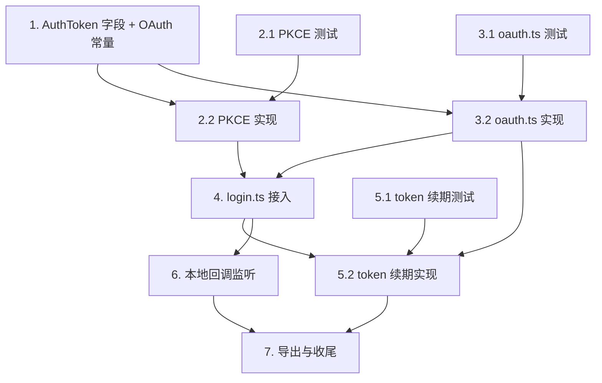

# Implementation Plan

> cz-cli OAuth2 登录接入 — 任务清单

## Overview

工作目录：`packages/clickzetta-sdk`。验证命令：`bun test <test-file>` 与 `bun typecheck`（均从包目录执行，不可在仓库根目录运行）。遵循 TDD：先写/对齐测试，再实现到测试通过。改造集中在 SDK 认证层（`types`、`pkce.ts`、`oauth.ts`、`login.ts`、`token.ts`、`callback-server.ts`）。

## Tasks

- [x] 1. 扩展 `AuthToken` 类型并新增 OAuth 常量
  - 在 `packages/clickzetta-sdk/src/types/index.ts` 的 `AuthToken` 接口新增可选字段 `refreshToken?: string`
  - 新增 `packages/clickzetta-sdk/src/auth/oauth-constants.ts`，导出 `OAUTH_CLIENT_ID`、`OAUTH_REDIRECT_URI`、`OAUTH_SCOPE`、`OAUTH_CODE_CHALLENGE_METHOD`
  - 运行 `bun typecheck` 确认无类型回归（修复 `login-oauth.test.ts` 中 `token.refreshToken` 的类型错误）
  - _Requirements: 4.5, 8.4_

- [x] 2. 实现 PKCE 生成模块
- [x] 2.1 编写 PKCE 单元/属性测试
  - 新增 `packages/clickzetta-sdk/test/pkce.test.ts`
  - 断言 `codeChallenge === base64url(sha256(codeVerifier))`（无 padding）
  - 断言 `codeVerifier` 长度 ∈ [43,128] 且仅含 unreserved 字符
  - 断言多次生成的 `codeVerifier` 互不相同
  - _Requirements: 2.1, 2.2, 2.3_
  - _Properties: 1, 2_
- [x] 2.2 实现 `pkce.ts`
  - 新增 `packages/clickzetta-sdk/src/auth/pkce.ts`，导出 `generatePkce(): Pkce`
  - 使用 `crypto.getRandomValues` 生成高熵 verifier，base64url 编码并裁剪到合法长度
  - `codeChallenge` = `base64url(sha256(codeVerifier))`，去除 `=`、`+`→`-`、`/`→`_`
  - 运行 `bun test test/pkce.test.ts` 通过
  - _Requirements: 2.1, 2.2, 2.3, 2.4_
  - _Properties: 1, 2_

- [x] 3. 实现 OAuth 端点客户端 `oauth.ts`
- [x] 3.1 编写 `oauth.ts` 单元测试
  - 新增 `packages/clickzetta-sdk/test/oauth.test.ts`，以 `globalThis.fetch` 桩模拟 `/oauth2/token` 与 `/oauth2/userinfo`
  - 覆盖：`exchangeAuthorizationCode` 发送正确的 form 字段（`grant_type`、`code`、`client_id`、`redirect_uri`、`code_verifier`）并解析 `expires_in→expiresInMs`
  - 覆盖：`refreshAccessToken` 发送 `grant_type=refresh_token`、`refresh_token`、`client_id`
  - 覆盖：`fetchUserInfo` 带 `Authorization: Bearer`，不回显敏感字段
  - 覆盖：各 OAuth 错误码（`invalid_request`/`invalid_client`/`invalid_scope`/`invalid_grant`/`invalid_token`）映射为 `InterfaceError`，且 message 不含敏感值
  - _Requirements: 4.1, 4.2, 4.3, 5.2, 6.1, 6.2, 6.3, 7.1, 7.2, 7.3, 7.4, 7.5, 7.6_
  - _Properties: 4, 7_
- [x] 3.2 实现 `oauth.ts`
  - 新增 `packages/clickzetta-sdk/src/auth/oauth.ts`，导出 `exchangeAuthorizationCode`、`refreshAccessToken`、`fetchUserInfo`、`OAuthTokenResult`
  - 请求体用 `URLSearchParams`（`application/x-www-form-urlencoded`）；端点为 `${baseUrl}/oauth2/token`、`${baseUrl}/oauth2/userinfo`
  - `expires_in`(秒) → `expiresInMs`(毫秒)；携带 requestId
  - 解析并映射 OAuth 错误码为 `InterfaceError`，错误信息屏蔽敏感值
  - 运行 `bun test test/oauth.test.ts` 通过
  - _Requirements: 4.1, 4.2, 4.3, 5.2, 6.1, 6.2, 6.3, 7.1, 7.2, 7.3, 7.4, 7.5, 7.6_
  - _Properties: 4, 7_

- [x] 4. 在 `login.ts` 接入 OAuth 授权码换取
  - 在 `packages/clickzetta-sdk/src/auth/login.ts` 的 `LoginResponse` 增加可选 `authorizationCode?: string`
  - `loginWithPassword`/`loginWithPat`：调用 `generatePkce()`，构造 `oauthLoginParam`（`oauthLogin:true`、`clientId`、`redirectUri`、`scope`、`codeChallenge`、`codeChallengeMethod:"S256"`）合并进登录 body
  - 登录成功后：`data.authorizationCode` 非空 → `exchangeAuthorizationCode(baseUrl, code, codeVerifier)` 并构造 `AuthToken`（`token=access_token`、`refreshToken`、`expireTimeMs=expires_in*1000`）；为空 → 保留 legacy token，不调用 `/oauth2/token`
  - 保持公开函数签名与既有重试/退避/实例错误识别逻辑不变
  - 运行 `bun test test/login-oauth.test.ts` 使其全部通过
  - _Requirements: 1.1, 1.2, 1.3, 1.4, 1.5, 3.7, 4.4, 8.1, 8.2, 8.3, 8.5_
  - _Properties: 3, 6_

- [x] 5. 在 `token.ts` 接入 refresh token 续期
- [x] 5.1 编写 token 续期测试
  - 在 `packages/clickzetta-sdk/test/`（新增或扩展 token 测试）覆盖：缓存 token 过期且含 `refreshToken` 时优先调用 `refreshAccessToken` 而非完整登录
  - 覆盖：续期成功后用轮换的新 `refreshToken` 覆盖旧值，后续续期使用最新值
  - 覆盖：续期失败（`invalid_grant`）清缓存并回退完整登录；仅 legacy token 时维持现有重新登录行为
  - _Requirements: 5.1, 5.3, 5.4, 5.5_
  - _Properties: 5_
- [x] 5.2 实现 `token.ts` 续期逻辑
  - 在 `packages/clickzetta-sdk/src/auth/token.ts` 的 `getToken` 中：过期且 `cachedToken.refreshToken` 存在时优先 `refreshAccessToken(baseUrl, refreshToken)`，成功则更新缓存（含新 refreshToken）
  - 续期失败回退 `fetchToken`；无 refreshToken 维持现状；`isTokenExpired` 与 `EXPIRED_FACTOR` 不变
  - 运行 token 相关测试通过
  - _Requirements: 5.1, 5.3, 5.4, 5.5_
  - _Properties: 5_

- [x] 6. 实现本地回调监听模块（默认禁用）
  - 新增 `packages/clickzetta-sdk/src/auth/callback-server.ts`，导出 `waitForAuthorizationCode(opts)`：在 loopback 启动一次性 HTTP 监听，解析 `?code=&state=`，校验 `state` 后关闭
  - 由开关（如 `CZ_OAUTH_LOCAL_CALLBACK`）控制；默认禁用时不占用端口、默认链路不调用
  - 新增 `packages/clickzetta-sdk/test/callback-server.test.ts`：启用时能从回调请求解析 code 并校验 state；禁用时不监听端口
  - _Requirements: 3.5, 3.6_

- [x] 7. 导出与集成收尾
  - 在 `packages/clickzetta-sdk/src/index.ts` 按需导出新增公共 API（`fetchUserInfo` 等，若供 CLI 使用）
  - 运行 `bun typecheck` 与全量 `bun test`（在 `packages/clickzetta-sdk` 包目录）确认无回归
  - 同步更新/新增 OpenSpec 规格 `openspec/specs/<topic>/spec.md`（中文、WHEN/THEN），与 `setup`/登录相关 spec 对齐（遵循仓库 spec-driven 工作流）
  - _Requirements: 6.1, 8.3_

- [x] 8. Refresh Token 跨进程持久化
- [x] 8.1 SDK：新增 `TokenStore` 接口并接入 `token.ts`
  - 在 `packages/clickzetta-sdk/src/types/index.ts` 新增 `TokenStore { load(): AuthToken | undefined; save(token: AuthToken): void; clear(): void }`，并在 `ConnectionConfig` 增加可选 `tokenStore?: TokenStore`
  - 改造 `packages/clickzetta-sdk/src/auth/token.ts` 的 `getToken`：内存未命中时先 `tokenStore.load()`；未过期直接复用；过期且有 refreshToken 则续期并 `save` 回写；登录/刷新成功 `save`；refresh 失败 `clear` 并回退完整登录；未注入 tokenStore 时退化为现有内存缓存
  - 先写测试 `packages/clickzetta-sdk/test/token-store.test.ts`：以内存假实现注入 tokenStore，覆盖「持久化未过期直接复用、不发请求」「过期用持久化 refresh 续期并回写轮换值」「续期失败 clear 后回退登录」「未注入时行为不变」
  - 从 `packages/clickzetta-sdk` 运行 `bun test test/token-store.test.ts`、全量 `bun test`、`bun typecheck`
  - _Requirements: 9.3, 9.4, 9.5, 9.7, 9.8_
  - _Properties: 8, 9, 10_
- [x] 8.2 cz-cli：profile-backed `TokenStore` 实现
  - 在 `packages/cz-cli/src/connection/profile-store.ts` 新增 `makeProfileTokenStore(profileName, cacheKey): TokenStore`，读写 `[profiles.<name>.oauth]` 子表（snake_case 键），复用 `writeProfilesFile` 原子写 + `0o600`；load/save/clear 均 best-effort 不抛错
  - 新增测试 `packages/cz-cli/test/profile-token-store.test.ts`（用 `CLICKZETTA_TEST_HOME` 指向临时目录）：save 后 load 往返一致、写入文件权限 0o600、clear 删除条目、不同 profile 隔离
  - 从 `packages/cz-cli` 运行相关 `bun test` 与 `bun typecheck`
  - _Requirements: 9.1, 9.2, 9.6_
- [x] 8.3 cz-cli：在 `resolveConnectionConfig` 注入 token store
  - 在 `packages/cz-cli/src/connection/config.ts` 解析出 profileName 后，将 `makeProfileTokenStore(profileName, cacheKey)` 挂到返回的 `ConnectionConfig.tokenStore`（cacheKey 用 `instance:pat||username`，与 SDK `cacheKey` 对齐）
  - 确认 `exec.ts`、`studio-context.ts` 经由该函数自动获得持久化；setup/verify 临时 config 不注入
  - 运行 `packages/cz-cli` 的 `bun typecheck` 与受影响测试，确保无回归
  - _Requirements: 9.3, 9.7_
- [x] 8.4 OpenSpec 同步与全量验证
  - 更新 `openspec/specs/oauth-login/spec.md`，补充「refresh token 跨进程持久化」需求（中文、WHEN/THEN，含正向与异常场景）
  - 从 `packages/clickzetta-sdk` 与 `packages/cz-cli` 分别运行全量 `bun test` 与 `bun typecheck`，展示输出
  - _Requirements: 9.1, 9.7_

- [x] 9. 浏览器 loopback 授权流程（动态 redirect_uri）
- [x] 9.1 SDK：`redirect_uri` 参数化 + loopback 常量
  - `packages/clickzetta-sdk/src/auth/oauth-constants.ts` 新增 `loopbackRedirectUri(port)`；保留 `OAUTH_REDIRECT_URI` 作默认
  - `packages/clickzetta-sdk/src/auth/oauth.ts` 的 `exchangeAuthorizationCode` 增加 `redirectUri` 参数（取代内部固定常量）；更新 `login.ts` 调用方传入 `OAUTH_REDIRECT_URI`（保持现有凭据路径行为不变）
  - 更新/新增测试：`test/oauth.test.ts` 断言换 token 使用传入的 redirectUri；全量 `bun test`、`bun typecheck`
  - _Requirements: 10.9_
- [x] 9.2 SDK：oauthLoginParam 构造/编码工具
  - 新增 `packages/clickzetta-sdk/src/auth/oauth-login-param.ts`：`buildOauthLoginParam({redirectUri, codeChallenge, state})`、`encodeOauthLoginParam(param)`（base64(JSON)）
  - `login.ts` 复用 `buildOauthLoginParam` 构造登录 body 中的 oauthLoginParam（行为等价，回归现有 login-oauth 测试）
  - 新增 `test/oauth-login-param.test.ts`：字段填充正确、base64 可解码还原；全量 `bun test`、`bun typecheck`
  - _Requirements: 10.3_
- [x] 9.3 SDK：callback-server 分离式 API
  - 在 `packages/clickzetta-sdk/src/auth/callback-server.ts` 新增 `startLoopbackCallback({expectedState, timeoutMs})` → `{ port, redirectUri, waitForCode(), close() }`，在 listen 完成后 resolve，复用现有解析/state 校验/超时/关闭逻辑
  - 扩展 `test/callback-server.test.ts`：先拿到 redirectUri（含实际端口）、再回调使 waitForCode resolve；state 不匹配/超时 reject
  - 从 `packages/clickzetta-sdk` 运行相关 `bun test` 与 `bun typecheck`
  - _Requirements: 10.2, 10.6, 10.7_
  - _Properties: 11, 12_
- [x] 9.4 cz-cli：accounts URL 推导
  - 新增 `packages/cz-cli/src/connection/accounts-url.ts`：`accountsBaseUrl(service)` 按环境推导（复用 `account-login.ts` 的 rootDomain/env 逻辑），支持 `CZ_OAUTH_ACCOUNTS_URL`/profile 覆盖
  - 新增测试覆盖 prod/dev/sit/uat 推导与覆盖项
  - 从 `packages/cz-cli` 运行 `bun test`、`bun typecheck`
  - _Requirements: 10.4_
- [x] 9.5 cz-cli：浏览器 loopback 登录编排（开关控制）
  - 新增浏览器登录编排：generatePkce + 随机 state → `startLoopbackCallback` 拿 redirectUri → `buildOauthLoginParam`+`encodeOauthLoginParam` 拼 `${accountsBase}/login?oauthLoginParam=<base64>` → 跨平台打开浏览器并打印 URL → `waitForCode` → `exchangeAuthorizationCode(baseUrl, code, codeVerifier, redirectUri)` → 经 tokenStore 持久化
  - 仅当 `isLocalCallbackEnabled()` 启用；默认走现有路径
  - 测试：注入假的 open/fetch，验证 authorize URL 内 redirectUri 与换 token 的 redirect_uri 逐字一致、state 往返、开关关闭时不起监听不开浏览器
  - 从 `packages/cz-cli` 运行相关 `bun test` 与 `bun typecheck`
  - _Requirements: 10.1, 10.5, 10.8, 10.10_
  - _Properties: 11, 12, 13_
- [x] 9.6 OpenSpec 同步与全量验证
  - 更新 `openspec/specs/oauth-login/spec.md` 增补「浏览器 loopback 授权流程」需求（中文 WHEN/THEN，正向+异常场景）
  - 分别在 `packages/clickzetta-sdk` 与 `packages/cz-cli` 运行全量 `bun test`、`bun typecheck`，展示输出
  - _Requirements: 10.1, 10.9_

- [x] 10. `cz-cli login` 命令接入浏览器登录
- [x] 10.1 实现 `login` 命令并注册
  - 新增 `packages/cz-cli/src/commands/login.ts`：`registerLoginCommand(cli)`，命令 `login`，选项 `--browser`（boolean）
  - handler：`resolveConnectionConfig(argv)` → 当 `--browser` 或 `isLocalCallbackEnabled()` 为真时，`loginWithBrowser({ baseUrl: toServiceUrl(cfg.service, cfg.protocol), accountsBaseUrl: accountsBaseUrl(cfg.service) })`，成功后用 `cfg.tokenStore?.save(token)` 持久化并 `success(...)` 输出（不回显敏感值）；否则提示需 `--browser`/`CZ_OAUTH_LOCAL_CALLBACK` 启用
  - 失败时 `error(...)` 并设非零退出码，不持久化
  - 在 `packages/cz-cli/src/register-commands.ts` 注册 `registerLoginCommand(cli)`，并在 `cli.ts` 的 `KNOWN_COMMANDS` 集合加入 `login`
  - 新增 `packages/cz-cli/test/login-command.test.ts`：注入 fake openBrowser/fetch，验证启用时走浏览器流程并持久化 token、未启用时给出指引、失败时不持久化
  - 从 `packages/cz-cli` 运行相关 `bun test` 与 `bun typecheck`
  - _Requirements: 11.1, 11.2, 11.3, 11.4, 11.5_
- [x] 10.2 OpenSpec 同步与验证
  - 更新 `openspec/specs/oauth-login/spec.md` 增补 `cz-cli login` 命令需求（中文 WHEN/THEN，正向+异常）
  - `packages/cz-cli` 运行 `bun typecheck` 与 OAuth 相关 `bun test`，展示输出
  - _Requirements: 11.1_

## Task Dependency Graph



```json
{
  "waves": [
    { "wave": 1, "tasks": ["1", "2.1", "3.1", "5.1"] },
    { "wave": 2, "tasks": ["2.2", "3.2"] },
    { "wave": 3, "tasks": ["4"] },
    { "wave": 4, "tasks": ["5.2", "6"] },
    { "wave": 5, "tasks": ["7"] },
    { "wave": 6, "tasks": ["8.1"] },
    { "wave": 7, "tasks": ["8.2"] },
    { "wave": 8, "tasks": ["8.3"] },
    { "wave": 9, "tasks": ["8.4"] },
    { "wave": 10, "tasks": ["9.1", "9.2", "9.4"] },
    { "wave": 11, "tasks": ["9.3"] },
    { "wave": 12, "tasks": ["9.5"] },
    { "wave": 13, "tasks": ["9.6"] },
    { "wave": 14, "tasks": ["10.1"] },
    { "wave": 15, "tasks": ["10.2"] }
  ]
}
```

## Notes

- 任务 1、2.1、3.1、5.1 之间互相独立，可并行（Wave 1）：类型/常量与各测试用例先行。
- 2.2 依赖 1 与 2.1；3.2 依赖 1 与 3.1（Wave 2）。
- 任务 4（login 接入）依赖 PKCE 与 oauth 客户端实现（Wave 3），完成后 `login-oauth.test.ts` 应通过。
- 5.2（token 续期）依赖 4 与 5.1、3.2；任务 6（本地回调）依赖 4，二者可并行（Wave 4）。
- 任务 7 收尾：导出公共 API、全量 typecheck/test，并按仓库 spec-driven 工作流同步 OpenSpec 规格（Wave 5）。
- 全程禁止在日志/错误信息中输出 `code_verifier`、授权码明文、`access_token`、`refresh_token`。
