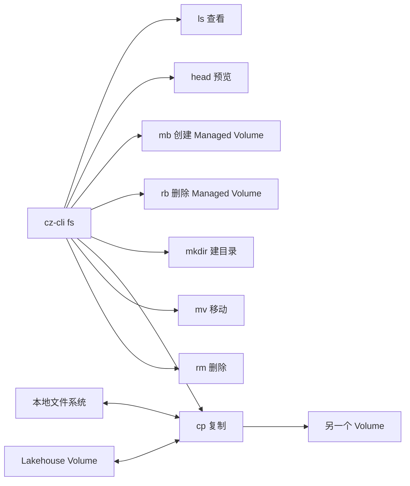

# cz-cli `fs` 命令设计

| 项目 | 内容 |
| --- | --- |
| 文档状态 | 命令与使用层设计 |
| 目标命令 | `cz-cli fs` |
| 设计来源 | Python Connector `FsUtil` |
| 目标用户 | CLI 用户、数据开发、自动化脚本、AI Agent |
| 更新时间 | 2026-08-31 |

> **一句话说明**
>
> `cz-cli fs` 用一组统一命令操作本地文件和 Lakehouse Volume 文件。主推 `czfs:/` 路径；路径写在左边就是源，写在右边就是目标；不对 CSV、Parquet、JSON 等文件格式做转换。

## 1. 设计结论

首版提供 8 个子命令：

| 命令 | 对应 FsUtil | 用途 |
| --- | --- | --- |
| `fs ls` | `ls()` + CLI 侧递归/截断 | 查看文件或目录；默认最多显示 100 条 |
| `fs head` | `head()` | 读取文件开头的文本内容 |
| `fs mb` | CLI 扩展 | 创建 Managed Volume 对象 |
| `fs rb` | CLI 扩展 | 删除 Managed Volume 对象 |
| `fs mkdir` | `mkdirs()` | 递归创建目录 |
| `fs cp` | `cp()` | 本地与 Volume 双向复制，也支持本地或 Volume 内部复制 |
| `fs mv` | `mv()` | 移动文件或目录 |
| `fs rm` | `rm()` | 删除文件或目录 |

命令关系如下：



## 2. 路径怎么写

### 2.1 `czfs` 路径规范（唯一依据）

以下协议以 Lakehouse Volume 路径规范为准，后续实现、CLI help、Agent system prompt 和测试不得自行推导或修改段数。

#### 2.1.1 规范结构

```text
czfs:/Volumes/@type/qualifiedname/path
```

规范示例：

```text
czfs:/Volumes/workspace1/schema1/volume1/path/data.csv
czfs:/Volumes/@table/workspace1/schema1/table1/path/data.csv
czfs:/Volumes/@user/workspace1/user1/path/data.csv
```

1. `czfs:` 是必填协议限定符，协议大小写不敏感。
2. Volume 根固定为 `/Volumes`（带 `czfs:` 时 `/Volume`、`/volume`、`/volumes` 作为大小写别名接受）；未带 `czfs:` 的 `/Volumes/...` 一律按本地路径处理，避免与 macOS 挂载目录冲突。
3. `@type` 大小写不敏感：
   - External Volume：`@external`，可省略；
   - Managed Volume：`@managed`，可省略；
   - Table Volume：`@table`，不可省略；
   - User Volume：`@user`，不可省略；
   - 其他类型：`@type` 不可省略，由子系统自行定义。
4. `qualifiedname` 字段不可省略，严格按 Volume 类型使用以下段数：

| Volume 类型 | qualifiedname |
| --- | --- |
| External Volume | `workspace_identifier/schema_identifier/volume_identifier` |
| Managed Volume | `workspace_identifier/schema_identifier/volume_identifier` |
| Table Volume | `workspace_identifier/schema_identifier/table_identifier` |
| User Volume | `workspace_identifier/username` |
| 其他类型 | 由子系统定义 |

> 规范与实现状态：本节是协议契约。客户端不得通过猜测省略 `czfs:`，也不得把裸 `/Volumes/...` 当成 Lakehouse Volume。

#### 2.1.2 三种 Volume 的生命周期

- Named/Managed Volume：先使用 `fs mb` 创建，再使用 `fs mkdir/cp/ls/rm` 操作；`fs rb` 删除对象。
- Table Volume：不能单独创建；先创建表，Lakehouse 自动生成 Table Volume，再使用 `@table` 路径操作。
- User Volume：系统自动提供，再使用 `@user` 路径操作。User Volume 的 `workspace_identifier/username` 是 `czfs` 协议中的 qualifiedname，不代表服务端支持跨用户寻址；服务端 SQL `USER VOLUME` 仍按当前会话用户语义执行。
- User Volume qualifiedname 中的 `username` 是 Lakehouse 用户名（通常与当前 profile 的 `username` 一致），不是 profile 名称或别名。

### 2.2 兼容路径格式

| 路径类型 | 格式 | 示例 |
| --- | --- | --- |
| 本地绝对路径 | `/path/to/file` | `/tmp/orders/a.parquet` |
| 本地相对路径 | `./path/to/file` | `./data/a.csv` |
| 本地 URI | `file:/path/to/file` | `file:/tmp/a.csv` |
| czfs Named / External | `czfs:/Volumes/<workspace>/<schema>/<volume>/path` | `czfs:/Volumes/your_workspace/your_schema/your_volume/data/a.csv` |
| czfs User | `czfs:/Volumes/@user/<workspace>/<user>/path` | `czfs:/Volumes/@user/your_workspace/your_user/data/a.csv` |
| czfs Table | `czfs:/Volumes/@table/<workspace>/<schema>/<table>/path` | `czfs:/Volumes/@table/your_workspace/your_schema/your_table/data/a.parquet` |
| Named / External Volume（兼容） | `volume://[workspace.][schema.]volume/path` | `volume://shared_files/data/a.csv` |
| User Volume（兼容） | `volume:user://~/path` | `volume:user://~/data/a.csv` |
| Table Volume（兼容） | `volume:table://workspace.schema.table/path` | `volume:table://demo.public.orders/stage/a.parquet` |

`czfs:/` 是 CLI 主推且必需的规范路径。兼容的 `volume:*://` 形式仍可解析，但不放在 `--help` 的首选示例中。

### 2.3 根路径与三种 Volume 用法

`fs ls` 对带 `czfs:` 的根路径使用对应的 Lakehouse 元数据命令。裸 `/Volumes` 路径不进入该分支，而是保留给本地文件系统：

命名空间根和部分 qualifiedname 路径（如 `czfs:/Volumes/@table/<workspace>/<schema>/`、`czfs:/Volumes/<workspace>/<schema>/`）只用于列出入口，不接受 `-R/--recursive`；`-R` 只对具体 Volume 或目录树生效。`@user/<workspace>/` 是当前 User Volume 的导航前缀，可用于递归列出当前用户文件。

| 根路径 | 查询 | 含义 |
| --- | --- | --- |
| `czfs:/` 或 `czfs:/Volumes/` | `SHOW VOLUMES` + 两个虚拟入口 | 列出 Managed/External 根，并提供 `@user`、`@table` 入口 |
| `czfs:/Volumes/@user/` | `SELECT current_user()` + `SHOW USER VOLUME DIRECTORY` | 列出当前 User Volume 文件；`@user/<workspace>/<username>/` 才是具体 User Volume 根 |
| `czfs:/Volumes/@user/<workspace>/` | `SELECT current_user()` + `SHOW USER VOLUME DIRECTORY` | 使用路径中的 workspace，并自动补全当前会话 username |
| `czfs:/Volumes/@table/` | `SHOW TABLES`（按 `is_view`/`is_materialized_view`/`is_external`/`is_dynamic` 过滤） | 列出当前 workspace/schema 下的 Table Volume 根 |
| `czfs:/Volumes/@table/<workspace>/` 或 `czfs:/Volumes/@table/<workspace>/<schema>/` | `SHOW TABLES` / `SHOW TABLES IN <schema>` | 按路径前缀列出并拼接 Table Volume 完整路径；路径明确给出 schema 且不同于当前 schema 时使用 `IN` |
| `czfs:/Volumes/<workspace>/` 或 `czfs:/Volumes/<workspace>/<schema>/` | `SHOW VOLUMES` | 按 workspace/schema 列出并拼接 Managed/External Volume 完整路径 |
| `czfs:/Volumes/<workspace>/<schema>/<volume>/` | `SHOW VOLUME DIRECTORY` | 列出 Managed/External Volume 文件 |
| `czfs:/Volumes/@user/<workspace>/<user>/` | `SHOW USER VOLUME DIRECTORY` | 列出 User Volume 文件 |
| `czfs:/Volumes/@table/<workspace>/<schema>/<table>/` | `SHOW TABLE VOLUME DIRECTORY` | 列出 Table Volume 文件 |
| `volume:table://`（兼容） | `SHOW TABLES` | 列出当前 workspace/schema 下的 Table Volume 根 |
| `volume:user://~/`（兼容） | `SELECT current_user()` + `SHOW USER VOLUME DIRECTORY` | 与 `czfs:/Volumes/@user/` 等价，输出同样的 czfs 路径 |

`@user`、`@table` 两个虚拟入口排在 `SHOW VOLUMES` 结果之前，保证 Volume 数量超过 `--limit` 时入口不被截断。

### 2.4 协议解析与服务端语义边界

客户端负责把规范路径解析为 Volume 类型、qualifiedname 和相对路径，再映射到 Lakehouse 的 SQL 关键字。协议解析单测只证明字符串解析和 SQL 标识符生成，不证明某个账号或引擎版本具备对应的服务端权限。

- `@external`、`@managed`、`@table`、`@user` 的大小写只影响解析，不改变 Volume 类型。
- External/Managed 的未标记形式按三段 qualifiedname 解析；Table/User 必须带类型标记。
- User Volume 的 `workspace_identifier/username` 是协议字段。Lakehouse `USER VOLUME` 的权限仍由当前会话用户决定，不能据此推断可以读写其他用户的 Volume。
- 服务端不接受把完整 `czfs:/...` URI 直接作为 SQL 的 Volume 参数；客户端必须先解析并校验相对路径，再生成 `VOLUME`、`TABLE VOLUME` 或 `USER VOLUME` 语句。
- 服务端返回的 `relative_path` 必须经过路径校验（拒绝空段、`.`、`..` 和控制字符），再以解码后的相对路径回填 SQL，避免路径穿越和二次编码。

### 2.5 `volume://` 的限定规则

`volume://` 通过点分段数判断 Volume 标识符：

| 写法 | 解释 |
| --- | --- |
| `volume://vol_a/a.csv` | 当前 workspace + 当前 schema + `vol_a` |
| `volume://public.vol_a/a.csv` | 当前 workspace + `public` + `vol_a` |
| `volume://demo.public.vol_a/a.csv` | `demo` + `public` + `vol_a` |

短地址只有在当前连接能够提供缺失的 workspace/schema 时才可用；否则必须返回 `FS_PATH_CONTEXT_REQUIRED`（退出码 `2`），不得猜测默认 workspace/schema。自动化脚本应使用三段全限定形式。

短地址仅保留给兼容的文件操作；`fs mb`/`fs rb` 始终要求三段完整的 Managed Volume 根路径。

Volume 标识符每段必须是非空标识符；点号只用于分隔限定名，标识符中的点号、斜杠和控制字符不支持。相对路径按 `/` 分段，客户端先 URL-decode 再检查，拒绝空段、`.`、`..` 和解码后路径穿越；普通空格、Unicode、`%` 和单引号按 URI 规则编码后保留原值。

> **建议**
>
> 人工和自动化操作统一优先使用全限定 `czfs:/Volumes/...`；`volume://` 只为兼容已有脚本。

### 2.6 路径方向

`cp` 和 `mv` 都使用统一顺序：

```text
cz-cli fs cp <source> <destination>
cz-cli fs mv <source> <destination>
```

例如：

```bash
# 上传：本地 → Volume
cz-cli fs cp ./a.csv volume://shared_files/a.csv

# 下载：Volume → 本地
cz-cli fs cp volume://shared_files/a.csv ./a.csv

# Volume → Volume
cz-cli fs cp volume://vol_a/a.csv volume://vol_b/a.csv
```

## 3. 完整命令表

| 命令 | 位置参数 | 专属参数 | 默认行为 |
| --- | --- | --- | --- |
| `fs ls` | `<path>` | `-R, --recursive`、`--limit`（CLI 扩展） | 当前层，最多显示 100 条 |
| `fs head` | `<file>` | `--bytes` | 读取前 65536 字节并按 UTF-8 输出 |
| `fs mb` | `<volume>` | 无 | 创建 Managed Volume；只接受 Managed Volume 根路径 |
| `fs rb` | `<volume>` | `--write` | 删除 Managed Volume 对象；不删除文件 |
| `fs mkdir` | `<path>` | 无 | 自动创建所有父目录 |
| `fs cp` | `<source> <destination>` | `-R`、`--overwrite/--no-overwrite` | 单向复制；默认拒绝已有目标 |
| `fs mv` | `<source> <destination>` | `-R`、`--overwrite/--no-overwrite` | 目标完成后删除源；默认拒绝已有目标 |
| `fs rm` | `<path>` | `-R`、`-f`（CLI 扩展）、`--dry-run`（CLI 扩展）、`--write` | 删除单文件；实际删除必须显式确认 `--write`，目录必须显式递归 |
| `table load` | `<table> <czfs-source>` | `--using`、`--header` | 仅做追加式 Volume → Table 导入；`COPY OVERWRITE` 和复杂场景使用 SQL |

### 3.1 FsUtil 参数对齐与 CLI 扩展

连接器 `FsUtil` 的公开参数以 `fsutil.py` 为准：

| 命令 | FsUtil 调用 | 参数语义 |
| --- | --- | --- |
| `fs ls` | `ls(dir)` | 无递归、limit 或分页参数；`-R` 和 `--limit` 都是 CLI 扩展 |
| `fs head` | `head(file, maxBytes=65536)` | `--bytes` 映射到 `maxBytes` |
| `fs mb` | CLI 扩展 | 将 Managed Volume 根路径转换为 `CREATE VOLUME` DDL |
| `fs rb` | CLI 扩展 | 将 Managed Volume 根路径转换为 `DROP VOLUME` DDL |
| `fs mkdir` | `mkdirs(dir)` | 创建目录及父目录 |
| `fs cp` | `cp(from_, to, recurse=False)` | CLI 默认 `overwrite=false`，用 `--overwrite` 显式覆盖 |
| `fs mv` | `mv(from_, to, recurse=False)` | CLI 默认 `overwrite=false`，用 `--overwrite` 显式覆盖 |
| `fs rm` | `rm(dir, recurse=False)` | `-R/--recursive` 映射到 `recurse` |

`--limit`、`--force`、`--dry-run`、`--overwrite/--no-overwrite` 等是 CLI 设计扩展，不是 Python `FsUtil` 原生参数。并发、重试、URL 有效期和空闲超时不属于命令行参数；SDK 使用统一的 Volume 传输重试策略处理临时网络错误。

### 3.2 输出格式、错误码和退出码

所有 `fs` 子命令都使用 CLI 全局 `--format`（也受 `CZ_FORMAT` 影响），默认格式为 `json`；未指定 `--format` 时不会因为命令是 `head` 就改为裸文本。

- `head --format text` 才输出文件内容，适合管道；`head --format json` 返回 `path`、`bytes`、`content`、`truncated` 等字段。
- 默认 JSON 成功响应使用统一 envelope：`{"data": ...}`；错误响应使用 `{"error":{"code":"...","message":"..."}}`。
- `--format pretty`、`table`、`csv`、`text`、`jsonl`、`toon` 只是同一响应的展示方式，不改变命令语义。`--field`、`--debug` 是 CLI 全局输出/诊断参数，也不是 `FsUtil` 参数。
- 对 `table`、`csv`、`text`、`jsonl` 等行式格式，错误输出统一为 `ERROR <code>: <message>`；仍以退出码判断成功或失败。

脚本应同时检查响应中的 `error.code` 和进程退出码：

| 退出码 | 含义 | 典型错误码 |
| ---: | --- | --- |
| `0` | 成功 | — |
| `1` | 业务或运行时失败 | `FS_NOT_FOUND`、`FS_TARGET_EXISTS`、`FS_PERMISSION_DENIED`、`FS_TRANSFER_FAILED`、`PARTIAL_FAILED`、`FS_INTERNAL_ERROR` |
| `2` | 参数或用法错误，命令未执行 | `FS_PATH_INVALID`、`FS_PATH_CONTEXT_REQUIRED`、`FS_LIMIT_INVALID`、`FS_RECURSIVE_REQUIRED`、缺少必填参数 |

`PARTIAL_FAILED` 是业务错误码，不是退出码；只要存在未完成文件，命令退出码仍为 `1`。

### 3.3 `mv` 支持矩阵

`fs mv` 支持本地→本地。由于连接器当前 `LocalPath.mv()` 会拒绝两个本地路径，CLI 对本地→本地文件或目录移动使用目标同级临时路径中转：先完整复制到临时路径，成功后再替换目标，最后删除源；复制或替换失败时保留源文件。

| 源 | 目标 | 是否支持 |
| --- | --- | --- |
| 本地 | Volume | 是 |
| Volume | 本地 | 是 |
| Volume A | Volume B | 是 |
| 本地 | 本地 | 是；CLI 使用临时路径中转 |

### 3.4 覆盖默认值

虽然 S3 `PutObject` 和 `CopyObject` 对同一 key 默认覆盖，CLI 文件操作采用更安全的默认：`fs cp` 和 `fs mv` 默认拒绝已有目标，必须显式传 `--overwrite` 才覆盖。

## 4. `--help` 最终展示

以下内容是本设计期望落地后的帮助文案。

### 4.1 `cz-cli fs --help`

```text
cz-cli fs

Manage local files and Lakehouse Volume files

Commands:
  cz-cli fs ls <path>                      List files or directories
  cz-cli fs head <file>                    Print the beginning of a UTF-8 text file, default bytes is 65536
  cz-cli fs mb <volume>                    Create a Managed Volume
  cz-cli fs rb <volume>                    Remove a Managed Volume object (requires --write)
  cz-cli fs mkdir <path>                   Create directories inside an existing filesystem or Volume
  cz-cli fs cp <source> <destination>      Copy a file or directory
  cz-cli fs mv <source> <destination>      Move a file or directory
  cz-cli fs rm <path>                      Remove a file or directory

Path formats:
  Local                 /tmp/a.csv, ./a.csv, file:/tmp/a.csv
  Managed/External Volume czfs:/Volumes/your_workspace/your_schema/your_volume/
  User Volume           czfs:/Volumes/@user/your_workspace/your_user/
  Table Volume          czfs:/Volumes/@table/your_workspace/your_schema/your_table/

Options:
      --profile     ClickZetta profile name                         [string]
      --workspace   Workspace name                                  [string]
  -s, --schema      Default schema                                  [string]
      --vcluster    Virtual cluster                                 [string]
      --format      Output format
                   [choices: "json", "pretty", "table", "csv", "text", "jsonl", "toon"]
      --field       Extract a single field from the response         [string]
  -d, --debug       Enable debug mode               [boolean] [default: false]
  -h, --help        Show help                                        [boolean]

Examples:
  cz-cli fs ls czfs:/
  cz-cli fs ls czfs:/Volumes/demo/public/shared_files/
  cz-cli fs ls czfs:/Volumes/@user/demo/alice/
  cz-cli fs ls czfs:/Volumes/@table/demo/public/orders/ -R
  cz-cli fs cp ./a.csv czfs:/Volumes/demo/public/shared_files/data/a.csv
  cz-cli fs rm czfs:/Volumes/demo/public/shared_files/tmp/ -R --dry-run

Long-running transfer:
  nohup cz-cli fs cp ./large.bin czfs:/Volumes/demo/public/shared_files/large.bin \
      > fs-transfer.log 2>&1 &

Defaults:
  fs ls displays at most 100 entries by default. Use --limit 0 for all entries.
```

### 4.2 `cz-cli fs ls --help`

```text
cz-cli fs ls <path>

List files or directories

Positionals:
  path  Local path or czfs Volume path                   [string] [required]

Options:
  -R, --recursive  Include files in all subdirectories (CLI extension)
                                                   [boolean] [default: false]
      --limit      Maximum entries to display after listing; 0 means unlimited
                                                     [number] [default: 100]
  -h, --help       Show help                                      [boolean]

Examples:
  cz-cli fs ls czfs:/
  cz-cli fs ls czfs:/Volumes/demo/public/shared_files/
  cz-cli fs ls czfs:/Volumes/@user/demo/alice/
  cz-cli fs ls czfs:/Volumes/@table/demo/public/orders/ -R
  cz-cli fs ls ./downloads --limit 0
```

`ls` 表格输出建议：

| path | type | size_bytes | modified_at |
| --- | --- | ---: | --- |
| `volume://shared_files/data/a.csv` | `file` | 1024 | `2026-08-21T10:10:00.000Z` |
| `volume://shared_files/data/dt=20260821` | `directory` | 0 | `2026-08-21T10:11:00.000Z` |

`fs ls` 的 `FsUtil.ls(dir)` 没有递归参数；`-R/--recursive` 是 CLI 侧递归遍历扩展。`--limit` 由 CLI 判断 `truncated` 并只输出前 `limit` 条；本地路径也只向 CLI 返回 `limit+1` 条。`--limit 0` 表示不截断。

`--limit` 的下推能力按语句区分，不能一概而论：

- 目录内路径走 `select list_directory(...)`，SDK 追加标准 `LIMIT limit+1`，由服务端截断。
- Volume 根路径走 `SHOW ... DIRECTORY`，该语句**不接受** `LIMIT`（实测），且返回整棵子树的扁平路径。SDK 只能在读取行时累计到上限后停止解析，行数本身仍由服务端决定。因此对超大 Volume，根路径的 `--limit` 不减少传输量，需要更窄的路径或 `SUBDIRECTORY` 才能收敛。
- `SHOW VOLUMES` 支持 `LIMIT`，但虚拟入口要保持在结果之前，目前仍在客户端截断。

`SHOW ... DIRECTORY` 支持 `SUBDIRECTORY '<path>'`（实测可用），是后续把根路径列举收敛到子树的可用手段。

已存在但为空的 Named/User Volume 根目录返回空 `entries`；不存在的 Volume 仍返回 `FS_NOT_FOUND`。
如果引擎不支持 `list_directory` 或对应的 `SHOW ... DIRECTORY` 语法，CLI 返回 `FS_TRANSFER_FAILED`，不得把 SQL 能力缺失误报为空目录。

`fs ls` 对本地和 Volume 路径都返回文件及目录条目；递归时返回遍历到的目录和文件。Volume 的 `list_directory` 返回顺序由服务端决定，CLI 不承诺跨后端排序一致性。

`--limit 0` 表示不截断，不代表服务端分页。递归目录的服务端函数仍可能先完成较大范围遍历，`LIMIT` 只限制返回行数。缺失或无效的修改时间输出为 `null`，不伪装成 Unix epoch 0；`SHOW ... DIRECTORY` 对无时间戳的行返回空字符串，必须映射为 `null`。

同一个逻辑目录只输出一条：`SHOW ... DIRECTORY` 可能同时返回 `logs/` 目录标记行和 `logs/app.txt` 文件行，CLI 按规范化后的段名去重。

`--limit` 只接受大于等于 `0` 的整数；负数属于参数错误并返回退出码 `2`。

Volume 的预签名 GET/PUT 保留统一的 `x-ms-blob-type: BlockBlob` 请求头。后端云类型不会从 Volume API 暴露；该策略已在 `quick_start.public` Managed Volume 部署中验证，避免按未知云厂商分支处理。

### 4.3 `cz-cli fs head --help`

```text
cz-cli fs head <file>

Print the beginning of a UTF-8 text file

Positionals:
  file  Local or Volume file path                          [string] [required]

Options:
      --bytes  Maximum bytes to read                  [number] [default: 65536]
  -h, --help   Show help                                         [boolean]

Examples:
  cz-cli fs head volume://shared_files/logs/app.log
  cz-cli fs head ./app.log --bytes 1024
```

使用约束：

- `head` 面向 UTF-8 文本，不解析 Parquet、图片、压缩包等二进制格式。
- 指定 `--format text` 时，stdout 只输出文件内容，方便管道处理；未指定时遵循全局默认 `json`。
- 显式指定 `--format json` 时，返回 `path`、`bytes`、`content`、`truncated`。
- `--bytes` 按字节读取并使用严格 UTF-8 解码，与 Python `read(maxBytes).decode("utf8")` 对齐。若截断落在多字节字符中间，返回 `FS_NOT_TEXT`，不回退字符边界，也不输出替换字符。
- 文件本身含非法 UTF-8 字节时同样返回 `FS_NOT_TEXT`；成功时 `bytes` 记录实际读取字节数，`truncated` 表示文件是否还有未返回内容。

### 4.4 `cz-cli fs mb --help`

```text
cz-cli fs mb <volume>

Create a Managed Volume (fs mb cannot create User or Table Volumes)

Positionals:
  volume  Managed Volume root, e.g. czfs:/Volumes/your_workspace/your_schema/your_volume
                                                               [string] [required]

Options:
  -h, --help  Show help                                            [boolean]

Examples:
  cz-cli fs mb czfs:/Volumes/your_workspace/your_schema/your_volume
  cz-cli fs mb czfs:/Volumes/your_workspace/your_schema/raw_files
```

行为约定：

- 只接受 Managed Volume 根路径，不接受子目录、本地路径、User Volume 或 Table Volume。
- `czfs:/Volumes/...` 根必须提供完整的 `workspace/schema/volume` qualifiedname；兼容的 `volume://name` / `volume://schema.name` 可在连接上下文完整时使用，客户端会补齐 workspace/schema。
- 等价于执行带标识符转义的 `CREATE VOLUME`，已有同名 Volume 返回 `FS_TARGET_EXISTS`。

### 4.5 `cz-cli fs rb --help`

```text
cz-cli fs rb <volume>

Remove a Managed Volume object

Positionals:
  volume  Managed Volume root                              [string] [required]

Examples:
  cz-cli fs rb czfs:/Volumes/your_workspace/your_schema/your_volume
```

`fs rb` 只删除空的 Managed Volume 对象，不删除其中文件；External、User、Table Volume 不能使用 `fs rb`。User Volume 由系统自动提供，Table Volume 随表自动创建。

### 4.6 `cz-cli fs mkdir --help`

```text
cz-cli fs mkdir <path>

Create a directory and missing parents inside an existing filesystem or Volume

Positionals:
  path  Local or Volume directory path                     [string] [required]

Options:
  -h, --help  Show help                                            [boolean]

Examples:
  cz-cli fs mkdir ./downloads/2026/08
  cz-cli fs mkdir czfs:/Volumes/your_workspace/your_schema/your_volume/data/2026/08
  cz-cli fs mkdir czfs:/Volumes/@user/your_workspace/your_user/data/2026/08
```

行为约定：

- 等价于 `mkdir -p`，父目录不存在时一并创建。
- 目录已存在时返回成功。
- 只能创建已有 Volume 内的目录，不能创建 Volume 对象。
- 对 Managed Volume 根路径执行 `fs mb` 创建对象；User/Table Volume 由 Lakehouse 自动提供，不能用 `fs mb` 创建。

### 4.7 `cz-cli fs cp --help`

```text
cz-cli fs cp <source> <destination>

Copy a file or directory

Positionals:
  source       Source local or Volume path                  [string] [required]
  destination  Destination local or Volume path             [string] [required]

Options:
  -R, --recursive     Copy files in all subdirectories
                                                   [boolean] [default: false]
      --overwrite      Replace existing destination files
                                                    [boolean] [default: false]
  -h, --help          Show help                                  [boolean]

Examples:
  cz-cli fs cp ./a.csv volume://shared_files/a.csv
  cz-cli fs cp ./a.csv volume://shared_files/
  cz-cli fs cp volume://shared_files/a.csv ./a.csv
  cz-cli fs cp volume://vol_a/a.csv volume://vol_b/a.csv
  cz-cli fs cp volume://shared_files/parquet/ ./parquet/ -R
  nohup cz-cli fs cp ./large.bin volume://shared_files/large.bin \
    > fs-transfer.log 2>&1 &
```

Agent/长任务提示：

- 大文件或目录传输不要让 Agent 同步等待，建议使用 `nohup ... > fs-transfer.log 2>&1 &`。
- `nohup` 让进程脱离当前终端；日志重定向会保存 stdout 和 stderr。
- 命令返回后台进程 PID 后，可用 `tail -f fs-transfer.log` 查看进度，或用 `ps -p <pid>` 检查进程。
- 后台进程结束后，应检查日志末尾和输出文件，再判断传输是否成功；不能只依据 `nohup` 命令已返回。

`cp` 复制方向支持矩阵：

| 源 | 目标 | 是否支持 | 说明 |
| --- | --- | --- | --- |
| 本地 | 本地 | 是 | 普通本地复制 |
| 本地 | Volume | 是 | 上传 |
| Volume | 本地 | 是 | 下载 |
| Volume A | Volume B | 是 | 跨 Volume 复制 |

目录规则：

- 不加 `-R`：只复制当前目录第一层文件。
- 加 `-R`：保留相对目录结构，复制全部子目录文件。
- 不加 `-R` 时不会创建子目录，也不会复制空目录；子目录中的文件会被跳过。
- 加 `-R` 时只为实际文件创建所需的目录结构，空目录仍不复制。
- 已存在目标默认拒绝；使用 `--overwrite` 才覆盖。
- 不识别文件格式，多个 Parquet 文件会原样逐个复制，不合并。

目标路径规则：

| 条件 | 结果 |
| --- | --- |
| 目标不存在 | 把目标参数作为完整目标路径 |
| 目标是已有目录（包括 Volume 根目录） | 在目标目录下追加源文件或源目录名称 |
| 目标是已有文件 | 默认失败；`--overwrite` 时覆盖 |

文件复制到目录：

```bash
cz-cli fs cp ./a.csv volume://shared_files/
```

如果 `volume://shared_files/` 已经是目录，结果是：

```text
volume://shared_files/a.csv
```

本地目录同理：

```bash
cz-cli fs cp volume://shared_files/a.csv ./downloads/
```

结果是：

```text
./downloads/a.csv
```

> **目录判断**
>
> 目标目录需要已经存在；仅仅在路径末尾加 `/` 不会把一个不存在的路径自动变成目录。需要时先执行 `cz-cli fs mkdir <destination>`。

示例：

```text
源：volume://shared_files/orders/
├── part-001.parquet
└── dt=20260821/
    └── part-002.parquet

命令：
cz-cli fs cp volume://shared_files/orders/ ./downloads/ -R

当 ./downloads 已存在时，结果：
./downloads/orders/
├── part-001.parquet
└── dt=20260821/
    └── part-002.parquet
```

### 4.8 `cz-cli fs mv --help`

```text
cz-cli fs mv <source> <destination>

Move a file or directory

Positionals:
  source       Source local or Volume path                  [string] [required]
  destination  Destination local or Volume path             [string] [required]

Options:
  -R, --recursive     Move files in all subdirectories
                                                   [boolean] [default: false]
      --overwrite      Replace existing destination files
                                                    [boolean] [default: false]
  -h, --help          Show help                                  [boolean]

Examples:
  cz-cli fs mv ./a.csv ./archive/a.csv
  cz-cli fs mv volume://shared_files/inbox/a.csv volume://shared_files/archive/a.csv
  cz-cli fs mv ./a.csv volume://shared_files/
  cz-cli fs mv volume://shared_files/a.csv ./downloads/
  cz-cli fs mv ./data/ volume://shared_files/data/ -R
```

行为约定：

- 本地→本地移动由 CLI 实现，不调用当前会拒绝该路径组合的 `LocalPath.mv()`。目标同级创建唯一临时路径，完整复制成功后再替换目标，最后删除源；任一步骤失败都不得删除源。
- CLI 在解析源路径后必须先获取类型；目录源未带 `-R/--recursive` 时，在任何复制或删除动作前返回 `FS_RECURSIVE_REQUIRED`（退出码 `2`）。
- 目录移动必须使用 `-R`。CLI 必须在复制前统一校验这一点，不能暴露 VolumePath 当前“先复制第一层、再删除失败”的副作用。
- 文件移动到已有目录时，会在目标目录下使用源文件名；例如 `fs mv ./a.csv volume://shared_files/` 生成 `volume://shared_files/a.csv`。
- 目录移动到已有 Volume 目录时，会在目标目录下追加源目录名称；例如 `fs mv ./data/ volume://shared_files/archive/` 生成 `volume://shared_files/archive/data/`。
- 目标目录需要已经存在；仅凭结尾 `/` 不自动创建目录。
- 已有目标默认拒绝；使用 `--overwrite` 时才覆盖。
- 本地→本地目录移动到已有目标目录时合并文件，不删除目标中源目录没有的文件；同名文件按覆盖策略处理。
- 单文件移动按“覆盖复制目标 → 删除源文件”执行；复制失败时保留源文件，删除源文件失败时保留已完成目标并返回 `PARTIAL_FAILED`。
- 目录移动先覆盖复制全部文件，全部复制成功后才删除源目录；复制阶段失败时不删除任何源文件，但目标端可能已有部分完成文件。
- 跨本地与 Volume、跨 Volume 的移动不承诺原子性。目录失败时返回 `PARTIAL_FAILED`，逐文件报告已完成目标、失败源文件、未尝试文件以及失败阶段（`COPY` 或 `REMOVE`）。
- 重试同一命令时遵循固定覆盖语义，重新复制源端仍存在的文件；只有本轮全部复制成功后才删除源目录。

### 4.9 `cz-cli fs rm --help`

```text
cz-cli fs rm <path>

Remove a file or directory

Positionals:
  path  Local or Volume path                                [string] [required]

Options:
  -R, --recursive  Remove a directory and all files below it
                                                   [boolean] [default: false]
  -f, --force      Do not fail when the path does not exist
                                                   [boolean] [default: false]
      --dry-run    List matched files without deleting them
                                                   [boolean] [default: false]
  -h, --help       Show help                                      [boolean]

Examples:
  cz-cli fs rm volume://shared_files/tmp/a.csv
  cz-cli fs rm volume://shared_files/tmp/ -R --dry-run
  cz-cli fs rm volume://shared_files/tmp/ -R
```

> **删除行为**
>
> - 删除 Volume 文件时，会删除底层对象存储中的物理文件，操作不可恢复。
> - `fs rm` 不会执行 `DROP VOLUME`，Volume 对象、权限和配置仍然保留。
> - 禁止删除本地文件系统根目录、Volume 根目录以及未解析到具体文件/子目录的路径。
> - 删除目录前建议先执行同一路径的 `fs ls -R` 或 `fs rm -R --dry-run`。

### 4.10 `cz-cli table load --help`

快捷命令以 `czfs:/` 源路径为中心，只覆盖常见的 Volume → Table 导入：

源路径以 `/` 结尾时按目录处理并生成 `SUBDIRECTORY`；不带尾斜杠时按单文件处理并生成 `FILES`。

```bash
cz-cli table load your_table czfs:/Volumes/your_workspace/your_schema/your_volume/data.csv --header
cz-cli table load your_table czfs:/Volumes/your_workspace/your_schema/your_volume/daily/ --using parquet
cz-cli table load your_table czfs:/Volumes/@user/your_workspace/your_user/data.csv
cz-cli table load your_table czfs:/Volumes/@table/your_workspace/your_schema/source_table/exports/ --using parquet
```

复杂的 `PURGE`、`ON_ERROR`、`PARTITION`、转换查询或高级格式参数，直接使用：

```bash
cz-cli sql --write "COPY INTO orders FROM VOLUME QiliangData USING CSV ..."
cz-cli sql --write "COPY OVERWRITE orders FROM VOLUME QiliangData USING CSV ..."
```
