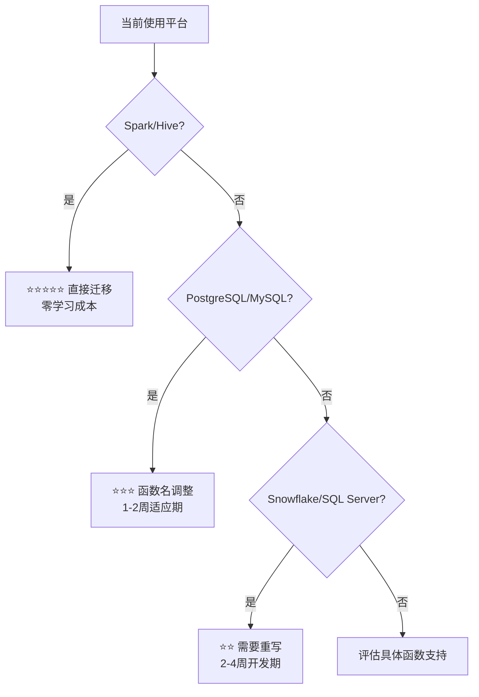

# Lakehouse JSON数据处理使用指南

## 文档介绍

本指南基于云器 Lakehouse 的实际验证测试，为数据工程师和开发者提供 JSON 数据类型的完整使用方案。无论您是从传统关系型数据库迁移，还是从Spark、Hive、Snowflake、Databricks等大数据平台转换，都能在此找到最佳实践和避坑指南。

JSON 是云器 Lakehouse 处理半结构化数据的核心特性，相比传统的字符串存储方案，提供了更高的查询性能、更智能的存储优化和更丰富的数据操作能力。

## 快速导航

### 立即开始

* [JSON数据类型概述](#json数据类型概述) → 理解核心概念
* [基础语法](#基础语法) → 5分钟上手使用
* [函数对照表](#函数对照表) → 快速查找正确函数
* [验证清单](#验证清单) → 确保正确实施

### 跨平台支持

* [兼容性总览](#兼容性总览) → 了解各平台支持情况
* [Spark/Hive用户](#apache-sparkhive-用户) → 零学习成本迁移
* [Snowflake用户](#snowflake-用户) → 重写指导
* [PostgreSQL/MySQL用户](#postgresqlmysql-用户) → 语法调整方案

### 核心功能

* [JSON vs STRING](#json-vs-string对比) → 选择正确的数据类型
* [JSON函数完全指南](#json函数完全指南) → 掌握所有JSON操作
* [JSON与生成列](#json与生成列) → 自动化衍生字段计算
* [性能优化](#性能优化) → 获得最佳查询性能

### 问题解决

* [常见错误](#常见错误) → 快速解决问题
* [限制和注意事项](#限制和注意事项) → 避免设计陷阱
* [迁移指导](#迁移指导) → 分阶段迁移策略

***

## JSON数据类型概述

### 核心优势

云器 Lakehouse 的 JSON 类型相比字符串存储具有显著优势：

1. **查询性能提升**：JSON 列支持列裁剪，只读取需要的字段，性能提升可达 40 倍
2. **智能存储优化**：高频字段自动列式存储，低频字段紧凑 JSON 存储
3. **自动类型推断**：数字优先解析为 bigint，超出范围自动转为 double
4. **原生函数支持**：丰富的 json_extract_* 函数系列，类型安全转换

### 数据存储机制

```sql
-- 云器Lakehouse自动优化存储策略
CREATE TABLE user_profiles (
    id INT,
    profile JSON  -- 智能存储：高频字段列式，低频字段JSON
);

-- 内部优化示例：
-- 高频字段如 id, name 自动列式存储
-- 低频字段如 extra_metadata 保持JSON结构
INSERT INTO user_profiles VALUES 
(1, parse_json('{"id": 1, "name": "张三", "age": 30, "extra_metadata": {"hobby": "篮球"}}')),
(2, parse_json('{"id": 2, "name": "李四", "age": 25, "city": "上海"}')),
(3, parse_json('{"id": 3, "name": "王五", "age": 35, "department": "技术部"}'));
```

***

## 兼容性总览

### 🎯 各平台兼容性评级

| 平台               | 兼容性等级    | 核心差异                 | 迁移难度  |
| ---------------- | -------- | -------------------- | ----- |
| **Apache Spark** | ⭐⭐⭐⭐⭐ 优秀 | 几乎完全兼容               | 🟢 简单 |
| **Apache Hive**  | ⭐⭐⭐⭐⭐ 优秀 | 函数名完全一致              | 🟢 简单 |
| **Databricks**   | ⭐⭐⭐⭐ 良好  | Spark兼容，部分Delta特性需调整 | 🟡 中等 |
| **PostgreSQL**   | ⭐⭐⭐ 中等   | 操作符不同，函数名不同          | 🟡 中等 |
| **MySQL**        | ⭐⭐⭐ 中等   | 函数签名有差异              | 🟡 中等 |
| **Snowflake**    | ⭐⭐ 需要适配  | 专有函数不支持              | 🔴 复杂 |
| **SQL Server**   | ⭐⭐ 需要适配  | JSON函数完全不同           | 🔴 复杂 |

### 决策树：选择最佳迁移路径



***

## 基础语法

### 创建JSON表

```sql
-- 基础JSON表结构
CREATE TABLE json_example (
    id INT,
    data JSON,           -- 原生JSON类型
    data_str STRING      -- 字符串形式的JSON（对比用）
);
```

### 插入JSON数据

```sql
-- 方法1：使用parse_json函数（推荐）
INSERT INTO json_example VALUES (
    1, 
    parse_json('{"name": "张三", "age": 30, "city": "北京"}'),
    '{"name": "张三", "age": 30, "city": "北京"}'
);

-- 方法2：使用json_object构建
INSERT INTO json_example VALUES (
    2,
    json_object('name', '李四', 'age', 25, 'hobbies', json_array('篮球', '旅游')),
    null
);

-- 方法3：直接使用JSON字面量
INSERT INTO json_example VALUES (
    3,
    json'{"name": "王五", "age": 35, "address": {"city": "上海", "zipcode": "200000"}}',
    null
);
```

***

## JSON vs STRING对比

### 性能对比（官方测试数据）

基于云器 Lakehouse 官方 1000 万条记录的性能测试：

| 操作类型   | STRING 存储 | JSON 存储 | 性能提升      |
| ------ | -------- | ------ | --------- |
| 字段过滤查询 | 20.4 秒    | 531 ms  | **38 倍**   |
| 数据扫描量  | 454 MB    | 153 MB  | **66% 减少** |
| 存储空间   | 100%     | ~80%  | **20% 节省** |

### 函数使用区别

```sql
-- ❌ 错误：在JSON类型上使用STRING函数
SELECT get_json_object(json_column, '$.name') FROM table_with_json;
-- 错误：function 'get_json_object' cannot be resolved, invalid type 'json'

-- ✅ 正确：JSON类型使用json_extract_*系列
SELECT json_extract_string(json_column, '$.name') FROM table_with_json;

-- ✅ 正确：STRING类型使用get_json_object
SELECT get_json_object(string_column, '$.name') FROM table_with_string;
```

***

## 函数对照表

### 通用函数分类

| 功能类别       | JSON类型函数                           | STRING类型函数                                    | 说明       |
| ---------- | ---------------------------------- | --------------------------------------------- | -------- |
| **字符串提取**  | `json_extract_string(json, path)`  | `get_json_object(str, path)`                  | 提取为字符串   |
| **数值提取**   | `json_extract_int(json, path)`     | `cast(get_json_object(str, path) as int)`     | 提取为整数    |
| **JSON提取** | `json_extract(json, path)`         | `get_json_object(str, path)`                  | 保持JSON格式 |
| **布尔提取**   | `json_extract_boolean(json, path)` | `cast(get_json_object(str, path) as boolean)` | 提取为布尔值   |
| **验证**     | `json_valid()`                     | `json_valid()`                                | 验证JSON格式 |

### 跨平台函数映射

#### Spark/Hive → 云器Lakehouse ⭐⭐⭐⭐⭐

| Spark/Hive函数                 | 云器Lakehouse函数                | 兼容性    |
| ---------------------------- | ---------------------------- | ------ |
| `get_json_object(str, path)` | `get_json_object(str, path)` | ✅ 完全相同 |
| `json_tuple(str, k1, k2)`    | `json_tuple(str, k1, k2)`    | ✅ 完全相同 |
| `to_json(map(...))`          | `to_json(map(...))`          | ✅ 完全相同 |
| `from_json(str, schema)`     | `from_json(str, schema)`     | ✅ 完全相同 |
| `collect_list(col)`          | `collect_list(col)`          | ✅ 完全相同 |

#### Snowflake → 云器Lakehouse ⭐⭐

| Snowflake语法                  | 云器Lakehouse等价语法                            | 说明       |
| ---------------------------- | ------------------------------------------ | -------- |
| `OBJECT_CONSTRUCT('k', 'v')` | `json_object('k', 'v')`                    | 构建JSON对象 |
| `ARRAY_CONSTRUCT(1,2,3)`     | `json_array(1,2,3)`                        | 构建JSON数组 |
| `json_col:field`             | `json_extract_string(json_col, '$.field')` | 字段访问     |
| `json_col[0]`                | `json_extract(json_col, '$[0]')`           | 数组索引     |
| `FLATTEN(json_col)`          | `LATERAL VIEW explode(...)`                | 数组展开     |

#### PostgreSQL → 云器Lakehouse ⭐⭐⭐

| PostgreSQL语法           | 云器Lakehouse等价语法                            | 说明        |
| ---------------------- | ------------------------------------------ | --------- |
| `json_col -> 'field'`  | `json_extract(json_col, '$.field')`        | 返回JSON    |
| `json_col ->> 'field'` | `json_extract_string(json_col, '$.field')` | 返回字符串     |
| `json_col #> '{a,b}'`  | `json_extract(json_col, '$.a.b')`          | 路径访问      |
| `json_col #>> '{a,b}'` | `json_extract_string(json_col, '$.a.b')`   | 路径访问返回字符串 |

#### MySQL → 云器Lakehouse ⭐⭐⭐

| MySQL函数                        | 云器Lakehouse函数                              | 核心差异    |
| ------------------------------ | ------------------------------------------ | ------- |
| `JSON_EXTRACT(json_str, path)` | `json_extract(json_obj, path)`             | 参数类型不同  |
| `json_str->'$.field'`          | `json_extract(json_obj, '$.field')`        | 操作符vs函数 |
| `json_str->>'$.field'`         | `json_extract_string(json_obj, '$.field')` | 操作符vs函数 |
| `JSON_OBJECT('k','v')`         | `json_object('k','v')`                     | 完全相同    |

### 完整的JSON\_EXTRACT函数系列

```sql
-- 基础提取（返回JSON格式）
json_extract(json_data, '$.field')

-- 类型安全提取
json_extract_string(json_data, '$.name')        -- 字符串
json_extract_int(json_data, '$.age')            -- 整数
json_extract_bigint(json_data, '$.id')          -- 大整数
json_extract_float(json_data, '$.score')        -- 浮点数
json_extract_double(json_data, '$.price')       -- 双精度
json_extract_boolean(json_data, '$.active')     -- 布尔值
json_extract_date(json_data, '$.birth_date')    -- 日期
json_extract_timestamp(json_data, '$.created')  -- 时间戳
```

***

## 按平台的迁移指南

### Apache Spark/Hive 用户 ⭐⭐⭐⭐⭐

**兼容性：几乎完美！零学习成本！**

#### ✅ 完全支持的功能

```sql
-- 1. Spark风格的JSON构建和解析
SELECT 
    to_json(map('name', '张三', 'age', 30)) as spark_json,
    from_json('{"name":"张三","age":30}', 'name STRING, age INT') as spark_struct;

-- 2. collect_list聚合（Spark用户最爱）
SELECT 
    department,
    collect_list(name) as employee_names
FROM employee_json
GROUP BY department;

-- 3. explode展开JSON数组
SELECT 
    id,
    hobby
FROM json_table 
LATERAL VIEW explode(split(regexp_replace(
    json_extract_string(json_data, '$.hobbies'), '[\\[\\]"]', ''), ',')) t AS hobby;

-- 4. 窗口函数完美支持
SELECT 
    name,
    salary,
    row_number() OVER (PARTITION BY department ORDER BY salary DESC) as rank
FROM employee_json;

-- 5. Hive json_tuple完全兼容
SELECT 
    name, age, city
FROM (
    SELECT json_tuple(json_string, 'name', 'age', 'city') as (name, age, city)
    FROM hive_json_table
) t;
```

#### 📝 Spark/Hive用户最佳实践

```sql
-- ✅ 推荐的迁移模式
CREATE TABLE lakehouse_events (
    event_id STRING,
    event_data JSON,
    
    -- 生成列：熟悉的字段提取
    event_type STRING GENERATED ALWAYS AS (json_extract_string(event_data, '$.type')),
    user_id STRING GENERATED ALWAYS AS (json_extract_string(event_data, '$.user_id')),
    timestamp_col TIMESTAMP GENERATED ALWAYS AS (
        cast(json_extract_string(event_data, '$.timestamp') as timestamp)
    )
) PARTITIONED BY (event_type);

-- 直接复制Hive查询，无需修改！
CREATE TABLE lakehouse_table AS 
SELECT 
    get_json_object(json_col, '$.user.id') as user_id,
    get_json_object(json_col, '$.user.name') as user_name,
    get_json_object(json_col, '$.event.type') as event_type
FROM source_table
WHERE get_json_object(json_col, '$.event.type') = 'purchase';
```

### Snowflake 用户 ⭐⭐

**兼容性：需要重写，但有明确的替代方案**

#### 🔄 Snowflake迁移示例

```sql
-- ❌ Snowflake原始查询
-- SELECT 
--     user_data:name::STRING as name,
--     user_data:age::INTEGER as age,
--     user_data:hobbies[0]::STRING as first_hobby
-- FROM snowflake_table;

-- ✅ 云器Lakehouse等价查询
SELECT 
    json_extract_string(user_data, '$.name') as name,
    json_extract_int(user_data, '$.age') as age,
    json_extract_string(user_data, '$.hobbies[0]') as first_hobby
FROM lakehouse_table;

-- ❌ Snowflake FLATTEN
-- SELECT 
--     value::STRING as hobby
-- FROM snowflake_table,
-- LATERAL FLATTEN(input => user_data:hobbies);

-- ✅ 云器Lakehouse等价方案
SELECT 
    trim(hobby) as hobby
FROM lakehouse_table 
LATERAL VIEW explode(
    split(regexp_replace(json_extract_string(user_data, '$.hobbies'), '[\\[\\]"]', ''), ',')
) t AS hobby;
```

### PostgreSQL/MySQL 用户 ⭐⭐⭐

**兼容性：函数不同，但逻辑相同**

#### PostgreSQL迁移示例

```sql
-- ❌ PostgreSQL原始查询
-- SELECT 
--     user_data ->> 'name' as name,
--     (user_data -> 'address' ->> 'city') as city,
--     user_data #>> '{preferences,0}' as first_pref
-- FROM postgres_table;

-- ✅ 云器Lakehouse等价查询
SELECT 
    json_extract_string(user_data, '$.name') as name,
    json_extract_string(user_data, '$.address.city') as city,
    json_extract_string(user_data, '$.preferences[0]') as first_pref
FROM lakehouse_table;
```

#### MySQL迁移注意事项

```sql
-- ❌ MySQL方式（针对字符串）
-- SELECT JSON_EXTRACT(json_string, '$.name') FROM mysql_table;

-- ✅ 云器Lakehouse方式（区分类型）
-- 对于STRING类型
SELECT get_json_object(json_string, '$.name') FROM lakehouse_table;

-- 对于JSON类型  
SELECT json_extract_string(json_data, '$.name') FROM lakehouse_table;
```

***

## JSON函数完全指南

### 1. JSON构建函数

```sql
-- json_object：构建JSON对象
SELECT json_object() as empty_obj;                    -- {}
SELECT json_object('key', 'value') as simple_obj;     -- {"key":"value"}
SELECT json_object(
    'name', '张三',
    'age', 30,
    'hobbies', json_array('篮球', '旅游')
) as complex_obj;
-- {"age":30,"hobbies":["篮球","旅游"],"name":"张三"}

-- json_array：构建JSON数组
SELECT json_array() as empty_arr;                     -- []
SELECT json_array(1, 2, 3) as number_arr;             -- [1,2,3]
SELECT json_array('a', 'b', 'c') as string_arr;       -- ["a","b","c"]
SELECT json_array(1, 'test', true, null) as mixed_arr; -- [1,"test",true,null]
```

### 2. JSON路径语法

```sql
-- 基础路径语法
'$'                    -- 根元素
'$.field'              -- 对象字段
'$.nested.field'       -- 嵌套对象字段
'$[0]'                 -- 数组第一个元素
'$[*]'                 -- 数组所有元素
'$.array[0].field'     -- 数组元素的字段
'$["key.with.dot"]'    -- 包含特殊字符的键（使用单引号）

-- 实际示例
SELECT 
    json_extract_string(data, '$.name') as name,
    json_extract_string(data, '$.address.city') as city,
    json_extract_string(data, '$.hobbies[0]') as first_hobby,
    json_extract(data, '$.hobbies[*]') as all_hobbies
FROM json_table;
```

### 3. JSON验证和错误处理

```sql
-- json_valid：验证JSON格式
SELECT 
    json_valid('{"name": "test"}') as valid,      -- true
    json_valid('invalid json') as invalid,       -- false
    json_valid('null') as null_valid,             -- true
    json_valid('[]') as array_valid,              -- true
    json_valid('{}') as object_valid;             -- true

-- 错误处理：不存在的字段返回null
SELECT 
    json_extract_string(data, '$.nonexistent') as result  -- 返回 null
FROM json_table;
```

***

## JSON与生成列

### 基础用法

```sql
-- 创建带JSON生成列的表
CREATE TABLE user_analytics (
    id INT,
    user_data JSON,
    -- 生成列：自动提取JSON字段
    user_name STRING GENERATED ALWAYS AS (
        json_extract_string(user_data, '$.name')
    ),
    user_age INT GENERATED ALWAYS AS (
        json_extract_int(user_data, '$.age')
    ),
    city STRING GENERATED ALWAYS AS (
        json_extract_string(user_data, '$.address.city')
    )
) COMMENT 'JSON自动字段提取示例';

-- 插入数据：只需提供基础JSON
INSERT INTO user_analytics (id, user_data) VALUES (
    1, 
    parse_json('{"name": "张三", "age": 30, "address": {"city": "北京", "zipcode": "100000"}}')
);

-- 查询结果：自动包含提取的字段
SELECT * FROM user_analytics;
-- 结果包含：id=1, user_name="张三", user_age=30, city="北京"
```

### 高级生成列应用

```sql
-- 复杂JSON业务逻辑生成列
CREATE TABLE order_analysis (
    id INT,
    order_json JSON,
    
    -- 基础字段提取
    customer_name STRING GENERATED ALWAYS AS (
        json_extract_string(order_json, '$.customer.name')
    ),
    order_amount DOUBLE GENERATED ALWAYS AS (
        json_extract_double(order_json, '$.amount')
    ),
    
    -- 业务逻辑生成列
    amount_level STRING GENERATED ALWAYS AS (
        if(json_extract_double(order_json, '$.amount') >= 1000, 'HIGH',
           if(json_extract_double(order_json, '$.amount') >= 500, 'MEDIUM', 'LOW'))
    ),
    
    -- 数组元素提取
    first_product STRING GENERATED ALWAYS AS (
        json_extract_string(order_json, '$.products[0].name')
    ),
    
    -- 时间维度生成列
    order_date STRING GENERATED ALWAYS AS (
        json_extract_string(order_json, '$.order_time')
    )
) PARTITIONED BY (order_date);
```

***

## 验证清单

### 创建后验证（每次必做）

```sql
-- 1. 创建带生成列的表
CREATE TABLE orders_test (
    order_id INT,
    order_time TIMESTAMP_LTZ,
    order_json JSON,
    hour_col INT GENERATED ALWAYS AS (json_extract_int(order_json, '$.hour')),
    date_str STRING GENERATED ALWAYS AS (json_extract_string(order_json, '$.date'))
);

-- 2. 验证表结构
DESCRIBE TABLE orders_test;
-- ✅ 检查：生成列是否出现在表结构中

-- 3. 测试数据插入
INSERT INTO orders_test (order_id, order_time, order_json) VALUES 
(1001, TIMESTAMP '2024-06-19 14:30:00', parse_json('{"hour": 14, "date": "2024-06-19"}'));

-- 4. 验证生成列值
SELECT order_id, hour_col, date_str FROM orders_test;
-- ✅ 检查：hour_col=14, date_str='2024-06-19'

-- 5. 验证插入保护机制
-- INSERT INTO orders_test (order_id, order_json, hour_col) VALUES 
-- (1002, parse_json('{"hour": 15}'), 999);
-- ✅ 检查：应该报错"cannot insert or update generated column"
```

### 跨平台兼容性验证

```sql
-- 6. 验证函数兼容性
SELECT 
    -- Hive/Spark风格（应该工作）
    get_json_object('{"name":"test"}', '$.name') as hive_style,
    
    -- JSON类型函数（应该工作）
    json_extract_string(parse_json('{"name":"test"}'), '$.name') as json_style,
    
    -- 聚合函数（应该工作）
    collect_list('test') as spark_aggregate;

-- 7. 验证性能差异
-- 对比JSON类型 vs STRING类型的查询性能
EXPLAIN SELECT json_extract_string(json_col, '$.field') FROM json_table;
EXPLAIN SELECT get_json_object(string_col, '$.field') FROM string_table;
```

***

## 性能优化

### 1. 存储优化策略

```sql
-- 高频字段优化：让系统自动识别并优化存储
CREATE TABLE optimized_storage AS 
SELECT parse_json(json_string) as optimized_json 
FROM VALUES 
    ('{"id": 1, "name": "张三", "frequent_field": "value1"}'),
    ('{"id": 2, "name": "李四", "frequent_field": "value2"}'),
    ('{"id": 3, "name": "王五", "frequent_field": "value3", "rare_field": "rare"}')
as t(json_string);

-- 系统会自动将id, name, frequent_field列式存储
-- rare_field保持JSON存储，避免稀疏列
```

### 2. 查询优化

```sql
-- ✅ 高性能：使用JSON类型 + 正确函数
SELECT 
    json_extract_string(json_data, '$.name'),
    json_extract_int(json_data, '$.age')
FROM json_table 
WHERE json_extract_string(json_data, '$.city') = '北京';

-- ❌ 低性能：使用STRING类型需要全表扫描
SELECT 
    get_json_object(string_data, '$.name'),
    get_json_object(string_data, '$.age')
FROM string_table 
WHERE get_json_object(string_data, '$.city') = '北京';
```

### 3. 通用高性能模式

```sql
-- 🎯 高性能模式：JSON + 生成列 + 索引
CREATE TABLE optimized_json (
    id BIGINT,
    raw_data JSON,
    
    -- 热点字段生成列
    user_id STRING GENERATED ALWAYS AS (json_extract_string(raw_data, '$.user_id')),
    timestamp_col TIMESTAMP GENERATED ALWAYS AS (
        cast(json_extract_string(raw_data, '$.timestamp') as timestamp)
    ),
    event_type STRING GENERATED ALWAYS AS (json_extract_string(raw_data, '$.event_type'))
) PARTITIONED BY (event_type);

-- 为生成列创建索引
CREATE INDEX idx_user_id ON optimized_json (user_id);
CREATE INDEX idx_timestamp ON optimized_json (timestamp_col);
```

***

## 限制和注意事项

### 1. JSON类型限制（通用）

```sql
-- ❌ 不支持的操作

-- 比较操作
SELECT * FROM json_table WHERE json_col = parse_json('{"key": "value"}');
-- 错误：operator not found, json = json

-- 排序操作
SELECT * FROM json_table ORDER BY json_col;
-- 错误：require equality comparable type in ORDER BY, but got json

-- 分组操作
SELECT json_col, COUNT(*) FROM json_table GROUP BY json_col;
-- 错误：不支持GROUP BY JSON类型

-- 作为JOIN键
SELECT * FROM table1 t1 JOIN table2 t2 ON t1.json_col = t2.json_col;
-- 错误：不支持JSON类型作为JOIN键
```

### 2. 分区和索引限制

```sql
-- ❌ 不支持作为分区键
CREATE TABLE partitioned_table (
    id INT,
    data JSON
) PARTITIONED BY (data);  -- 错误：不支持JSON作为分区键

-- ✅ 正确做法：使用生成列作为分区键
CREATE TABLE partitioned_correct (
    id INT,
    data JSON,
    date_part STRING GENERATED ALWAYS AS (json_extract_string(data, '$.date'))
) PARTITIONED BY (date_part);
```

### 3. 路径语法限制

```sql
-- ❌ 不支持的路径语法
-- 负数索引：'$[-1]'
-- 条件过滤：'$[?(@.price > 10)]'
-- 递归下降：'$..'

-- ✅ 支持的路径语法
'$.field'              -- 字段访问
'$.nested.field'       -- 嵌套字段
'$[0]'                 -- 数组索引
'$[*]'                 -- 数组所有元素
'$["field.with.dot"]'  -- 特殊字符字段（单引号）
```

***

## 常见错误

### 1. 函数类型错误

| 错误现象                                                                       | 原因                 | 解决方案                      |
| -------------------------------------------------------------------------- | ------------------ | ------------------------- |
| `function 'get_json_object' cannot be resolved, invalid type 'json'`       | 在JSON类型上使用STRING函数 | 改用`json_extract_string()` |
| `function 'json_extract_string' cannot be resolved, invalid type 'string'` | 在STRING类型上使用JSON函数 | 改用`get_json_object()`     |
| `operator not found, json = json`                                          | 尝试比较JSON值          | 提取为基础类型后比较                |

### 2. 路径语法错误

```sql
-- ❌ 错误的路径语法
json_extract_string(data, 'name')           -- 缺少$前缀
json_extract_string(data, '$.key.with.dot') -- 特殊字符需要括号

-- ✅ 正确的路径语法
json_extract_string(data, '$.name')
json_extract_string(data, '$["key.with.dot"]')  -- 注意使用单引号
```

### 3. 平台迁移常见错误

```sql
-- ❌ Snowflake用户常犯错误
-- SELECT user_data:name FROM table;  -- 不支持:操作符

-- ❌ PostgreSQL用户常犯错误  
-- SELECT user_data->'name' FROM table;  -- 不支持->操作符

-- ❌ MySQL用户常犯错误
-- SELECT JSON_EXTRACT(json_data, '$.name') FROM table;  -- 参数类型错误

-- ✅ 统一的正确语法
SELECT json_extract_string(user_data, '$.name') FROM table;  -- JSON类型
SELECT get_json_object(user_string, '$.name') FROM table;    -- STRING类型
```

***

## 迁移指导

### 分阶段迁移策略

#### 阶段1：评估和准备（1-2周）

```sql
-- 1. 评估现有JSON使用情况
SELECT 
    table_name,
    column_name,
    data_type,
    count(*) as usage_count
FROM information_schema.columns 
WHERE data_type LIKE '%json%' OR column_name LIKE '%json%'
GROUP BY table_name, column_name, data_type;

-- 2. 识别高频JSON操作
-- 分析现有查询中的JSON函数使用情况
```

#### 阶段2：兼容性测试（1-2周）

```sql
-- 3. 创建测试表验证兼容性
CREATE TABLE migration_test (
    id INT,
    old_json_string STRING,     -- 保持原有格式
    new_json_data JSON,         -- 新的JSON类型
    -- 双重生成列验证
    field_old STRING GENERATED ALWAYS AS (get_json_object(old_json_string, '$.field')),
    field_new STRING GENERATED ALWAYS AS (json_extract_string(new_json_data, '$.field'))
);

-- 4. 性能基准测试
-- 对比旧查询 vs 新查询的性能差异
```

#### 阶段3：渐进迁移（2-4周）

```sql
-- 5. 新表直接使用JSON类型
CREATE TABLE new_design_table (
    id INT,
    data JSON,
    -- 关键字段生成列
    user_id STRING GENERATED ALWAYS AS (json_extract_string(data, '$.user_id')),
    event_type STRING GENERATED ALWAYS AS (json_extract_string(data, '$.event_type'))
) PARTITIONED BY (event_type);

-- 6. 现有表添加JSON列
ALTER TABLE existing_table ADD COLUMN 
json_data JSON GENERATED ALWAYS AS (parse_json(json_string));
```

#### 阶段4：全面迁移（根据业务窗口）

```sql
-- 7. 更新应用代码
-- 将所有JSON操作切换到新的函数和列

-- 8. 清理旧列（确认稳定后）
-- ALTER TABLE table_name DROP COLUMN old_json_string;
```

***

## 最佳实践总结

### 1. 设计原则

1. **类型选择**：优先使用 JSON 类型而非 STRING 存储半结构化数据
2. **字段提取**：为常用字段创建生成列，提高查询性能
3. **索引策略**：在生成列上创建索引，而不是原始 JSON 列
4. **分区设计**：使用生成列作为分区键，支持时间分区等

### 2. 平台适应策略

* **Spark/Hive用户**：几乎无需学习，直接迁移
* **Snowflake用户**：重点学习函数映射，逐步重写查询
* **PostgreSQL/MySQL用户**：重点适应函数名差异
* **新用户**：直接学习云器Lakehouse的JSON最佳实践

### 3. 性能优化清单

* [ ] 使用JSON类型而非STRING类型
* [ ] 为高频查询字段创建生成列
* [ ] 在生成列上创建适当索引
* [ ] 使用生成列进行分区
* [ ] 定期监控查询性能和存储效率

### 4. 迁移检查清单

#### 迁移前评估

* [ ] 识别当前使用的JSON函数和操作符
* [ ] 评估数据类型（STRING vs JSON）
* [ ] 确定性能关键路径
* [ ] 制定分阶段迁移计划

#### 语法转换

* [ ] 函数名映射完成
* [ ] 路径语法验证
* [ ] 错误处理机制调整
* [ ] 性能优化点识别

#### 测试验证

* [ ] 功能等价性测试
* [ ] 性能基准测试
* [ ] 边界情况验证
* [ ] 错误处理测试

#### 上线准备

* [ ] 回滚方案准备
* [ ] 监控指标配置
* [ ] 团队培训完成
* [ ] 文档更新完成

***

## 总结

### 核心价值

1. **性能显著提升**：相比STRING存储，查询性能提升可达40倍
2. **跨平台兼容**：对Spark/Hive用户零学习成本，其他平台有明确迁移路径
3. **存储智能优化**：高频字段列式存储，低频字段紧凑JSON存储
4. **开发效率提升**：丰富的类型安全函数，自动化字段提取
5. **架构简化**：统一的半结构化数据处理方案

### 关键要点

**平台选择指导**：

* **Spark/Hive用户**：直接迁移，享受性能提升。
* **Snowflake/SQL Server用户**：投入重写成本，获得长期收益。
* **PostgreSQL/MySQL用户**：适中的学习成本，显著的性能收益。

**JSON vs STRING 选择**：
JSON 类型提供更好的性能和功能，应优先选择。只有在需要兼容旧系统或特殊场景下才考虑 STRING 存储。

**函数选择要点**：
记住核心规则：JSON 类型用 `json_extract_*` 系列，STRING 类型用 `get_json_object`。类型不匹配是最常见的错误。

**生成列设计**：
JSON与生成列的结合是云器Lakehouse的强大特性，可以自动化复杂的字段提取逻辑，显著提升开发效率。

通过正确使用JSON功能，您将获得更高的查询性能、更好的存储效率和更简洁的代码架构。无论来自哪个平台，都能在云器Lakehouse中充分发挥JSON的强大能力！

***

**注意**：本文档基于 Lakehouse 2025 年 6 月的产品文档整理，建议定期查看官方文档获取最新更新。在生产环境中使用前，请务必在测试环境中验证所有操作的正确性和性能影响。
